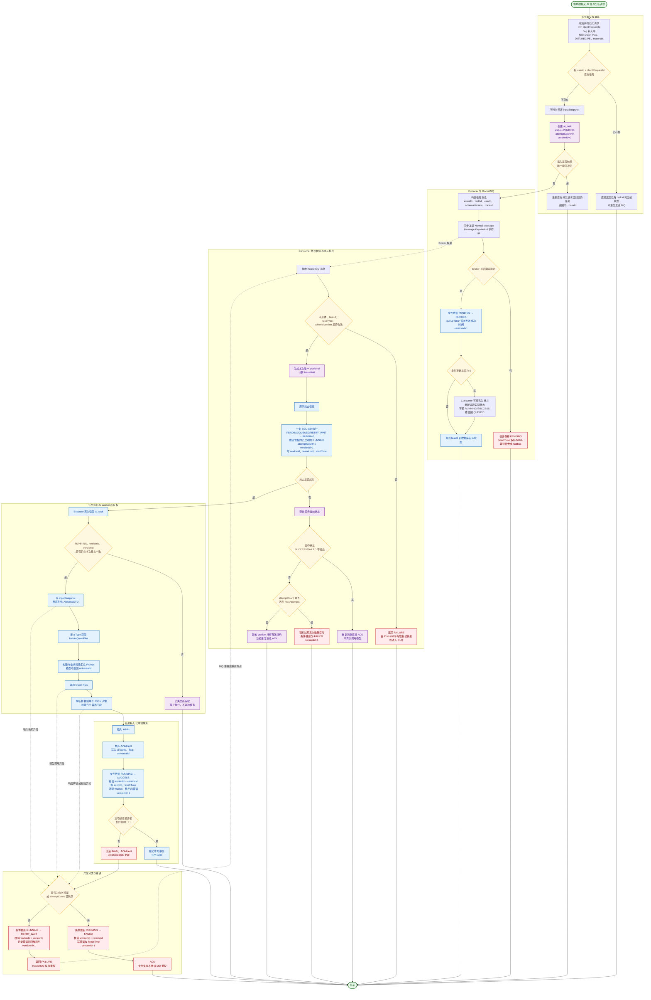
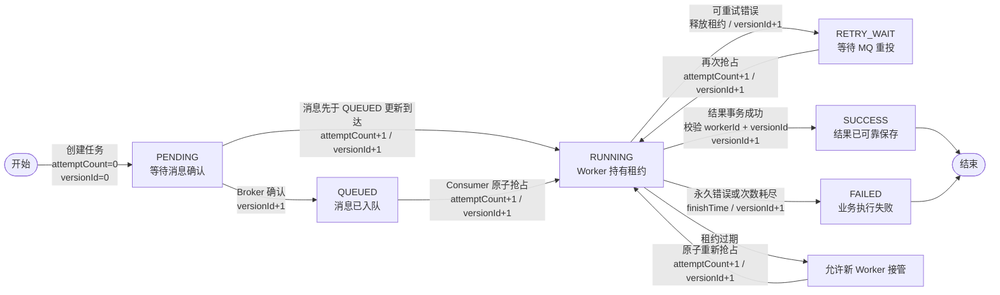

# AI 应用 RocketMQ——版本 1

> 本图对应当前第一版代码实现，覆盖任务提交幂等、RocketMQ 投递、Consumer 原子抢占、任务执行、结果事务、失败重试、`attemptCount`、`versionId` 和租约控制。

## 核心字段变化

## 字段语义

- `attemptCount`：只在 Consumer 成功抢占、准备进入一次模型执行流程时由数据库递增；MQ 重复投递、协议解析失败和抢占失败均不递增。
- `versionId`：创建时为 `0`，每次有效状态迁移都由数据库执行 `version_id = version_id + 1`。
- `workerId + versionId`：共同证明当前线程仍拥有 RUNNING 任务；旧 Worker 失去租约后不能再提交 SUCCESS、FAILED 或 RETRY_WAIT。
- `leaseUntil`：Consumer 抢占时写入；离开 RUNNING 状态时清空，租约过期后允许其他 Worker 接管。
- `finishTime`：只在 SUCCESS 或 FAILED 终态写入，PENDING、QUEUED、RUNNING、RETRY_WAIT 均保持为空。
