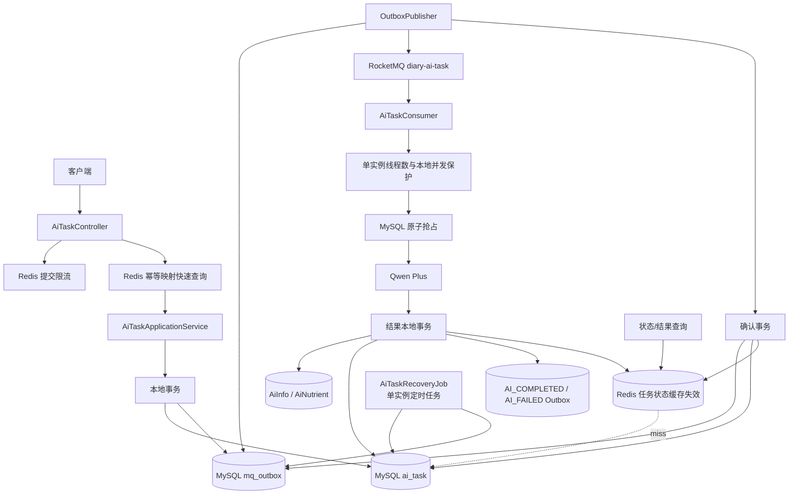
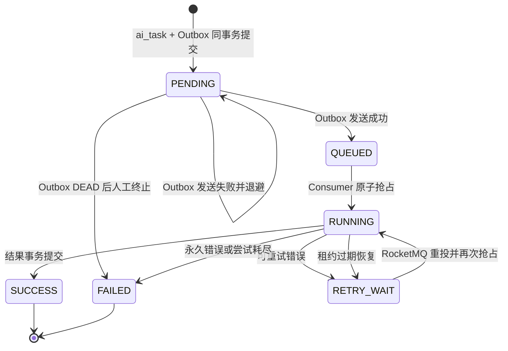

# AI 应用 RocketMQ——版本 2（单实例微服务实践：Outbox + Redis）

> 本文档基于当前第一版代码和《diary-AI 接入 RocketMQ 异步改造方案》制定。第二版只聚焦**单实例微服务工程能力**：MySQL 保证业务事实与可靠投递，RocketMQ 负责异步解耦，Redis 用于任务查询缓存、提交幂等加速和基础请求计数。多实例协调、分布式锁、分布式限流等内容统一留到第三版重点突破。

## 1. 第二版定位

第一版已经完成以下关键能力：

- `userId + clientRequestId` 数据库唯一约束保证提交幂等。
- 创建 `ai_task` 后同步发送 RocketMQ Normal Message。
- Consumer 原子抢占 `PENDING / QUEUED / RETRY_WAIT`，并可接管租约过期的 `RUNNING`。
- `attemptCount` 只在成功抢占时增加。
- `workerId + versionId` 防止旧 Worker 覆盖新 Worker 的执行结果。
- `AiInfo + AiNutrient + SUCCESS` 在本地事务中落库。
- 可重试错误进入 `RETRY_WAIT`，永久错误或次数耗尽进入 `FAILED`。
- `ai_nutrient.ai_task_id` 关联任务，避免重复保存同一任务的结果。

第二版重点解决第一版仍存在的四类微服务工程问题：

1. **可靠投递**：当前先插入 `ai_task`，再直接发送 MQ。应用在两步之间宕机会留下永久 `PENDING` 任务。
2. **查询压力**：前端轮询任务状态时，每次都会访问 MySQL；当前也尚未提供完整状态和结果查询接口。
3. **单实例流量与费用保护**：通过 Consumer 线程数、本地并发控制和 Redis 提交计数限制当前 diary-AI 实例的调用压力。
4. **恢复闭环**：Mapper 虽已有租约恢复 SQL，但还缺少真正运行的恢复调度、可靠补发和可观测闭环。

第二版不引入：

- RocketMQ 事务消息。第二版先把 Outbox 做正确。
- Redis Stream、Redis List 或 Redis Pub/Sub 作为第二套消息队列。
- 用 Redis 保存唯一任务事实、输入快照或最终营养结果。
- 多实例 Outbox 抢占与集群调度协调。
- 分布式锁、分布式信号量、分布式限流和全局 Token/费用配额。
- 多种 AI 模型和复杂任务编排。

以上分布式能力不是取消，而是作为第三版的主线，避免第二版同时跨越过多技术层级。

## 2. 第二版目标架构



### 2.1 三种基础设施的职责边界

| 组件 | 第二版职责 | 不能承担的职责 |
| --- | --- | --- |
| MySQL | 任务事实、状态机、输入快照、结果、Outbox、唯一约束 | 不承担热点查询缓存 |
| RocketMQ | 任务异步投递、至少一次消费、重试和 DLQ | 不作为任务状态数据库 |
| Redis | 热点状态缓存、幂等快速路径、单实例阶段的提交计数 | 不作为唯一真相，不替代 Outbox 和消费幂等 |

核心原则：**Redis 中的数据可以丢、可以过期、可以重建；MySQL 中的任务与 Outbox 不能丢。**

## 3. 第二版完整流程

### 3.1 提交任务

```text
1. 校验并规范化请求。
2. 使用 Redis 对 userId 做短周期提交限流。
3. 查询 Redis 幂等映射 ai:idem:{userId}:{requestHash}。
4. 命中后仍以 MySQL 任务记录为准，确认任务存在并直接返回。
5. 未命中时查询 MySQL 的 userId + clientRequestId。
6. MySQL 已存在：回填 Redis 幂等映射并返回原任务。
7. MySQL 不存在：在同一个本地事务中插入 ai_task(PENDING) 和 mq_outbox(NEW)。
8. 事务提交后回填 Redis 幂等映射和任务状态缓存。
9. 接口立即返回 taskId + PENDING，不等待 Broker。
10. OutboxPublisher 异步发送任务消息。
11. Broker 确认后，在一个本地事务中将 Outbox 标记为 SENT，并条件更新任务 PENDING → QUEUED。
12. 删除或更新 Redis 任务状态缓存。
```

第二版提交接口返回 `PENDING` 是正常语义：它表示任务和待发送事件已经可靠入库。无需为了返回 `QUEUED` 而让 HTTP 请求等待 RocketMQ。

### 3.2 消费与执行

```text
1. Consumer 校验消息协议。
2. 查询 MySQL 任务终态；SUCCESS / FAILED / CANCELLED 直接 ACK。
3. 通过一条 SQL 原子抢占任务：状态 → RUNNING、attemptCount + 1、versionId + 1、写入租约。
4. 从 MySQL input_snapshot 恢复请求；不能从 Redis 恢复输入。
5. 由 Consumer 线程数和本地 Semaphore 控制当前实例的模型并发。
6. 调用 Qwen Plus，解析并校验单个营养汇总对象。
7. 在一个本地事务中保存 AiInfo、AiNutrient，条件更新 SUCCESS，并写入 AI_COMPLETED Outbox。
8. 事务提交后删除任务缓存。
9. finally 中释放本地并发许可。
10. 可重试异常写 RETRY_WAIT 并返回消费失败；永久错误或次数耗尽写 FAILED 并 ACK。
```

第二版只保证单个 diary-AI 实例的模型并发上限。部署多个实例后的全集群并发控制属于第三版；第一版已有的 `workerId + versionId` 数据库所有权校验继续保留。

### 3.3 查询任务

采用 Cache-Aside：

```text
GET /ai/tasks/{taskId}
    ↓
查询 Redis ai:task:{taskId}
    ├─ 命中：返回缓存
    └─ 未命中：查询 MySQL → 写入带 TTL 的缓存 → 返回
```

状态更新事务提交后删除缓存，下一次查询从 MySQL 重建。不要在数据库事务提交前更新缓存，否则事务回滚时 Redis 会暴露不存在的状态。

## 4. Outbox 可靠投递设计

### 4.1 为什么第二版必须先做 Outbox

当前第一版存在以下窗口：

```text
插入 ai_task 成功
    ↓
应用宕机或 Broker 不可用
    ↓
MQ 未收到消息，ai_task 永久停在 PENDING
```

Outbox 将其改成：

```text
同一个 MySQL 事务
    ├── 插入 ai_task
    └── 插入 mq_outbox
事务提交后，即使应用立即宕机，Publisher 仍可在恢复后继续发送
```

### 4.2 `mq_outbox` 建议表结构

以下为 MySQL 8 示例，字段类型需要结合现有库规范调整：

```sql
CREATE TABLE mq_outbox (
    id                BIGINT       NOT NULL,
    event_id          VARCHAR(64)  NOT NULL,
    aggregate_type    VARCHAR(32)  NOT NULL,
    aggregate_id      BIGINT       NOT NULL,
    event_type        VARCHAR(64)  NOT NULL,
    topic             VARCHAR(128) NOT NULL,
    tag               VARCHAR(64)  NOT NULL,
    message_key       VARCHAR(128) NOT NULL,
    payload           JSON         NOT NULL,
    schema_version    INT          NOT NULL DEFAULT 1,
    status            VARCHAR(16)  NOT NULL,
    retry_count       INT          NOT NULL DEFAULT 0,
    max_retries       INT          NOT NULL DEFAULT 10,
    next_retry_time   DATETIME(3)  NOT NULL,
    broker_message_id VARCHAR(128) NULL,
    last_error        VARCHAR(1000) NULL,
    sent_time         DATETIME(3)  NULL,
    create_time       DATETIME(3)  NOT NULL,
    update_time       DATETIME(3)  NOT NULL,
    version_id        INT          NOT NULL DEFAULT 0,
    PRIMARY KEY (id),
    UNIQUE KEY uk_outbox_event_id (event_id),
    KEY idx_outbox_publish (status, next_retry_time, update_time),
    KEY idx_outbox_aggregate (aggregate_type, aggregate_id)
);
```

建议状态：

```text
NEW ──抢占──> SENDING ──Broker确认──> SENT
                 │
                 ├──发送失败──> RETRY_WAIT ──到期──> SENDING
                 └──超过上限──> DEAD
```

### 4.3 任务创建事务

建议新增 `AiTaskCommandService`，并把事务放在实现类的 public 方法上：

```java
@Transactional
public AiTaskPO createTaskAndOutbox(AiInvokeDTO request) {
    // 1. insert ai_task(status=PENDING)
    // 2. insert mq_outbox(status=NEW, eventType=AI_TASK_CREATED)
    // 3. 任一步失败时整体回滚
}
```

`AiTaskApplicationServiceImpl` 不再直接调用 `AiTaskProducer.send()`。Producer 只允许由 Outbox Publisher 调用，避免其他业务代码绕过可靠投递。

### 4.4 单实例 Outbox Publisher

第二版只运行一个 diary-AI 实例，因此先实现一个清晰、可恢复的定时 Publisher：

1. 分页查询 `NEW / RETRY_WAIT` 且已到发送时间的 Outbox。
2. 使用 `status + versionId` 条件更新为 `SENDING`，避免同一实例内的调度重叠。
3. 在数据库事务外发送 RocketMQ。
4. Broker 确认后用短事务写 `SENT`；失败则写 `RETRY_WAIT` 和 `nextRetryTime`。

每批建议 20～50 条。发送网络调用不能长时间持有数据库事务：

```text
短事务领取并提交 SENDING
    ↓
事务外调用 RocketMQ
    ↓
短事务写 SENT 或 RETRY_WAIT
```

单实例内仍要保留 `SENDING` 超时恢复，因为应用可能在发送过程中宕机。多个实例同时领取 Outbox、`SKIP LOCKED`、数据库租约竞争等内容放入第三版。

### 4.5 Broker 已成功但 SENT 未落库

仍可能发生：

```text
RocketMQ 已收到消息
    ↓
Publisher 写 SENT 前宕机
    ↓
Outbox 租约过期后再次发送相同 eventId
```

因此：

- 每次重发必须沿用同一个 `eventId`、`taskId` 和 Message Key。
- Consumer 继续以任务状态和数据库唯一约束保证幂等。
- 不要因为使用 Outbox 就删除第一版的原子抢占和结果唯一约束。

### 4.6 Outbox 退避时间

建议带抖动的指数退避：

```text
nextRetryAt = now + min(2^retryCount × 5 秒, 10 分钟) + random(0～3 秒)
```

达到 `maxRetries` 后将 Outbox 置为 `DEAD` 并告警。任务保持 `PENDING`，由人工或补偿流程判断是否重新激活 Outbox；不能静默丢弃。

## 5. Redis 设计

### 5.1 Redis 的三个明确用途

第二版只在以下三处使用 Redis：

1. **任务状态热点缓存**：降低前端轮询对 MySQL 的压力。
2. **提交幂等快速路径**：快速找到 `clientRequestId` 对应的 `taskId`。
3. **基础提交计数**：练习 Redis 原子计数和 TTL，对单实例入口做用户级频率保护。

第一版的 Redis 工具只支持简单字符串读写，且过期单位被固定成分钟，不适合直接承载上述语义。第二版建议在 `diary-AI` 内建立面向业务的 Redis 组件，底层使用 `StringRedisTemplate`；提交计数可通过一段简单 Lua 保证 `INCR + EXPIRE` 原子执行。业务代码不直接拼 Key，也不直接操作通用 `RedisTemplate<String, Object>`。

### 5.2 Key 规范

建议统一前缀并带环境标识：

| Key | 类型 | TTL | 用途 |
| --- | --- | --- | --- |
| `diary:{env}:ai:task:{taskId}` | String/JSON | 运行态 30 秒，终态 24 小时 | 任务状态查询缓存 |
| `diary:{env}:ai:idem:{userId}:{requestHash}` | String | 24 小时 | `clientRequestId → taskId` 快速映射 |
| `diary:{env}:ai:submit:rate:{userId}:{window}` | String | 2 分钟 | 用户提交固定窗口计数 |

`requestHash` 使用规范化后 `clientRequestId` 的 SHA-256 截断值，避免用户输入直接出现在 Redis Key 中。

### 5.3 任务状态缓存

缓存内容只放查询所需字段：

```json
{
  "taskId": "2000000000001",
  "status": "RUNNING",
  "attemptCount": 1,
  "maxAttempts": 3,
  "resultId": null,
  "errorCode": null,
  "createdAt": "2026-08-13T10:00:00+08:00",
  "startedAt": "2026-08-13T10:00:03+08:00",
  "finishedAt": null,
  "versionId": 2
}
```

不要缓存：

- `inputSnapshot`。
- 完整 Prompt 或模型原始响应。
- API Key、AccessKey、SecretKey。
- 超长错误堆栈。

一致性策略：

- 读：Redis 命中直接返回；未命中读 MySQL 并重建缓存。
- 写：MySQL 状态事务提交后删除缓存，不做“先写 Redis 再写 MySQL”。
- 防穿透：任务不存在时可缓存短期空值 10～30 秒，但必须校验 taskId 格式。
- 防雪崩：TTL 增加 0～10% 随机抖动。
- Redis 异常：查询退化到 MySQL，不能导致任务查询不可用。

### 5.4 提交幂等缓存

Redis 幂等映射只是快速路径，MySQL 唯一索引仍是最终防线：

```text
Redis 命中 taskId
    ↓
MySQL 确认任务存在
    ├── 存在：返回原任务
    └── 不存在：删除脏缓存，继续正常创建流程
```

任务事务提交后再写 Redis。即使多个请求同时未命中 Redis，数据库 `UNIQUE(user_id, client_request_id)` 仍会保证只创建一个任务。

第二版不为提交幂等增加锁。数据库唯一约束已经提供正确性，Redis 只负责快速查询。

### 5.5 用户提交限流

可先采用 Lua 固定窗口计数，保证 `INCR + EXPIRE` 原子执行。例如：

```text
单用户：每分钟最多 10 个新任务
```

重复 `clientRequestId` 查询不应重复消耗“新任务额度”；因此推荐先检查幂等映射/数据库，再对真正的新任务执行限流。

达到限制时返回 HTTP 429，并包含稳定错误码 `AI_SUBMIT_RATE_LIMITED`。不要创建 `ai_task`，也不要发送 MQ。

### 5.6 Qwen Plus 单实例并发保护

第二版不使用 Redis 分布式信号量。先通过微服务内部的两个配置控制压力：

```text
RocketMQ Consumer 线程数：1～2
本地 Semaphore 最大许可数：1～2
DashScope 总执行超时：明确配置，不能无限等待
```

Consumer 获取本地许可后才调用模型，并在 `finally` 中释放。无法及时获得许可时不要进入无间隔重试，可降低 Consumer 线程数，让消息在 RocketMQ 中形成正常、可观察的积压。

这只能限制当前实例。第三版部署多个 diary-AI 实例时，再实现 Redis ZSet 租约信号量、全局速率限制、许可续期和宕机回收。

### 5.7 单实例恢复任务

`AiTaskRecoveryJob` 在第二版直接使用 Spring `@Scheduled` 或 XXL-Job 单实例执行，不增加 Redis 分布式锁。数据库恢复 SQL 仍必须带 `status + versionId + leaseUntil` 条件，防止同一轮调度重叠或人工操作造成状态覆盖。

第三版扩展为多实例部署时，再为调度任务增加带 token 的分布式锁或使用 XXL-Job 的集群调度能力。

## 6. 状态机调整

第二版主状态保持简洁：



注意：Outbox 状态和任务状态是两个不同状态机。`mq_outbox.RETRY_WAIT` 不等于 `ai_task.RETRY_WAIT`：

- Outbox `RETRY_WAIT`：任务消息尚未可靠发送。
- Task `RETRY_WAIT`：消息已消费，但本次模型执行发生可重试错误。

不要用同一个字段混合表达这两种失败。

## 7. 恢复与补偿任务

### 7.1 Outbox Publisher

每 1～3 秒扫描：

```text
status IN (NEW, RETRY_WAIT)
AND next_retry_time <= now()
```

另行将 `status = SENDING AND update_time < now() - sendingTimeout` 的记录恢复为 `RETRY_WAIT`。每条消息发送成功后更新 `SENT`，并条件推进 `ai_task.PENDING → QUEUED`。

### 7.2 RUNNING 租约恢复

每 30～60 秒扫描：

```text
status = RUNNING
AND lease_until < now()
```

- `attemptCount < maxAttempts`：条件更新为 `RETRY_WAIT`，清除 Worker 和租约，并补发同一 taskId 的新事件。
- `attemptCount >= maxAttempts`：条件更新为 `FAILED`，写 `AI_RETRY_EXHAUSTED`，并创建 `AI_FAILED` Outbox。

恢复补发必须写 Outbox，不能在恢复 Job 中直接调用 Producer。

### 7.3 PENDING 停留告警

正常情况下 PENDING 会由 Outbox Publisher 推进。建议告警：

```text
PENDING 超过 2 分钟：Warning
PENDING 超过 10 分钟：Critical
对应 Outbox 已 DEAD：立即 Critical
```

## 8. API 调整

### 8.1 提交任务

```text
POST /ai/tasks
```

成功返回 HTTP 202：

```json
{
  "taskId": "2000000000001",
  "status": "PENDING",
  "message": "AI分析任务已受理"
}
```

### 8.2 查询状态

```text
GET /ai/tasks/{taskId}
```

查询走 Redis Cache-Aside，响应包含 `versionId`，方便前端判断状态是否推进。

### 8.3 查询结果

```text
GET /ai/tasks/{taskId}/result
```

- `SUCCESS`：从 MySQL 返回营养结果。
- `PENDING / QUEUED / RUNNING / RETRY_WAIT`：HTTP 202 或统一业务码表示尚未完成。
- `FAILED`：返回稳定错误码和可展示摘要，不返回内部堆栈。

最终结果不建议只存在 Redis。可在确有高频读取后再给结果增加短期缓存，但 MySQL 始终是结果事实源。

## 9. 推荐代码结构

```text
diary-AI
└── src/main/java/diary/diaryai
    ├── controller
    │   └── AiTaskController
    ├── application
    │   ├── AiTaskApplicationService
    │   └── AiTaskQueryService
    ├── domain
    │   ├── AiTaskStatus
    │   ├── OutboxStatus
    │   └── OutboxEventType
    ├── outbox
    │   ├── AiOutboxService
    │   ├── AiOutboxPublisher
    │   └── AiOutboxRepository
    ├── redis
    │   ├── AiRedisKeyFactory
    │   ├── AiTaskCacheService
    │   ├── AiIdempotencyCacheService
    │   └── AiSubmitRateLimiter
    ├── recovery
    │   └── AiTaskRecoveryJob
    ├── guard
    │   └── LocalAiConcurrencyGuard
    ├── rocketmqhandler
    │   ├── producer/AiTaskProducer
    │   └── consumer/AiTaskConsumer
    └── executor
        └── AiTaskExecutor
```

对当前代码的具体调整：

| 当前类/文件 | 第二版调整 |
| --- | --- |
| `AiTaskApplicationServiceImpl` | 移除直接 `send()`；调用任务 + Outbox 事务服务；接入提交限流和幂等缓存 |
| `AiTaskProducer` | Topic、Tag、超时改为配置项；只由 `AiOutboxPublisher` 调用 |
| `AiTaskConsumer` | 常量配置化；模型调用前获取本地 Semaphore；状态提交后失效缓存 |
| `AiTaskExecutor` | 保持从 MySQL 快照执行；成功事务中追加 `AI_COMPLETED` Outbox |
| `DiaryAiMapper` | 增加 Outbox 领取/状态更新、过期 RUNNING 分页扫描、状态/结果查询 SQL |
| `DiaryAIMapper.xml` | 保留所有条件状态迁移；新增 Outbox SQL 和查询索引友好的分页语句 |
| `DiaryAIController` | 增加状态与结果 GET 接口，处理 202、404、429 语义 |
| `RedisUtil` | 不继续扩展为万能工具；新增 AI 领域 Redis 服务和 Lua 脚本 |

建议 `diary-AI/pom.xml` 直接声明 `spring-boot-starter-data-redis` 和需要的 `diary-config/diary-utils` 依赖，不依赖 `diary-file` 的传递依赖来“顺便获得 Redis”。如果 diary-AI 已不需要文件模块能力，应评估移除对 `diary-file` 的反向耦合。

## 10. 配置建议

Nacos 中建议增加：

```yaml
diary:
  ai:
    rocketmq:
      task-topic: diary-ai-task
      task-tag: QWEN_PLUS_NUTRIENT
      event-topic: diary-ai-event
      publisher-batch-size: 20
      publisher-interval-ms: 1000
      publisher-sending-timeout-seconds: 60
      outbox-max-retries: 10
    task:
      max-attempts: 3
      execution-lease-seconds: 330
      recovery-interval-seconds: 30
    cache:
      running-ttl-seconds: 30
      terminal-ttl-hours: 24
      idempotency-ttl-hours: 24
      null-ttl-seconds: 15
    limit:
      submit-per-user-per-minute: 10
      model-local-concurrency: 2
```

Redis 连接继续由 Spring/Nacos 统一管理。不同环境必须使用不同 Key 前缀，Topic 也应带环境隔离或使用独立实例，避免测试任务进入生产消费者。

当前代码中以下内容需要配置化：

- `AiTaskProducer` 的 `diary-ai-task:QWEN_PLUS_NUTRIENT`。
- Consumer 的 `SUPPORTED_SCHEMA_VERSION`、`TASK_TYPE`、5 分钟租约。
- `MAX_ATTEMPTS`。
- RocketMQ endpoint。
- Redis Key 前缀、TTL、提交计数阈值和本地模型并发数。

## 11. Redis 故障降级原则

| Redis 用途 | Redis 不可用时的处理 |
| --- | --- |
| 状态缓存 | 降级查询 MySQL，并记录缓存降级指标 |
| 幂等映射 | 降级到 MySQL 唯一索引和幂等查询 |
| 提交计数 | 第二版练习环境可降级为本地计数，并记录告警；MySQL 幂等约束继续生效 |

必须为 Redis 操作设置短连接/命令超时，避免 Redis 故障把 HTTP 线程阻塞。缓存异常不能回滚已经成功提交的 MySQL 事务。Qwen Plus 并发由本地 Semaphore 控制，不依赖 Redis 可用性。

## 12. 事务边界

第二版至少明确三个本地事务：

### 12.1 提交事务

```text
insert ai_task
insert mq_outbox(AI_TASK_CREATED)
```

### 12.2 发布确认事务

```text
update mq_outbox SENDING → SENT
update ai_task PENDING → QUEUED
```

如果第二步更新为 0，重新读取任务真实状态。Consumer 可能已经从 PENDING 抢占，不能把 RUNNING 或 SUCCESS 倒退回 QUEUED。

### 12.3 结果事务

```text
insert ai_info
insert ai_nutrient（ai_task_id 唯一）
update ai_task RUNNING → SUCCESS（workerId + versionId）
insert mq_outbox(AI_COMPLETED)
```

任何一步失败全部回滚。事务提交后再删除 Redis 缓存。

失败终态也建议在同一事务中：

```text
update ai_task RUNNING → FAILED
insert mq_outbox(AI_FAILED)
```

## 13. 可观测性

### 13.1 新增日志字段

```text
outboxId
outboxStatus
outboxRetryCount
redisOperation
redisKeyType
cacheHit
rateLimitResult
localPermitWaitMs
localActiveCount
recoveryBatchId
```

日志中不打印完整 Redis Key 的用户输入部分，也不打印输入快照和完整模型响应。

### 13.2 新增指标

- `ai_task_cache_hit_total / miss_total / error_total`
- `ai_submit_rate_limited_total`
- `ai_model_local_concurrency_active / wait_seconds`
- `ai_outbox_new / sending / retry_wait / dead`
- `ai_outbox_publish_success_total / failure_total / latency`
- `ai_task_pending_age_seconds_max`
- `ai_task_expired_running_total / recovered_total`
- Redis 命令耗时、连接池活跃数和错误率。

### 13.3 告警

- Outbox `DEAD > 0`。
- 最老未发送 Outbox 超过 2 分钟。
- PENDING 最老任务超过 2 分钟。
- RUNNING 租约过期任务持续存在。
- Redis 错误率连续 1 分钟超过阈值。
- 本地模型并发持续打满且 RocketMQ Lag 增长。
- RocketMQ Lag、重试或 DLQ 增长。

## 14. 实施顺序

### 阶段 1：整理第二版基线

- 将任务状态、Outbox 状态、错误码改为枚举或常量。
- 将 Topic、Tag、租约、最大尝试次数配置化。
- 增加状态和结果查询接口，但先只查 MySQL。
- 为状态查询、Outbox 扫描和租约扫描补齐索引。

完成标准：第一版行为不退化，查询接口可用。

### 阶段 2：实现 Outbox 主链路

- 新建 `mq_outbox` 表、PO、Mapper 和状态机。
- 任务创建与 Outbox 同事务。
- 删除提交链路中的直接 MQ 发送。
- 实现单实例 Outbox Publisher、失败退避和 SENDING 超时恢复。
- 验证 Broker 不可用时任务仍可靠保留并在恢复后发送。

完成标准：在任意“任务提交事务后、Broker 发送前”位置杀进程，重启后任务都能继续投递。

### 阶段 3：接入 Redis 查询缓存和幂等快速路径

- `diary-AI` 显式引入 Redis 依赖。
- 建立 KeyFactory 和领域缓存服务。
- 查询状态使用 Cache-Aside。
- 状态事务提交后失效缓存。
- 提交幂等命中时回查 MySQL。
- 演练 Redis 清空和 Redis 暂时不可用。

完成标准：Redis 数据全部删除后系统仍正确，只是查询变慢。

### 阶段 4：接入基础提交计数与本地并发控制

- Lua 实现用户提交限流。
- 使用 Consumer 线程数和本地 Semaphore 控制模型并发。
- 模型调用 `finally` 释放本地许可。
- 从 1～2 个 Consumer 并发开始压测。

完成标准：单个 diary-AI 实例的真实模型并发不超过配置上限，提交超限时返回 HTTP 429。

### 阶段 5：单实例恢复任务闭环

- 使用 `@Scheduled` 或 XXL-Job 运行单实例恢复任务。
- 扫描并恢复过期 RUNNING。
- 补发统一写 Outbox。
- 次数耗尽写 FAILED + AI_FAILED Outbox。
- 增加 PENDING、Outbox DEAD 和租约过期告警。

完成标准：Consumer 在 RUNNING 中宕机后，无人工改库也能自动恢复或收敛为 FAILED。

### 阶段 6：AI 结果事件

- 成功事务写 `AI_COMPLETED` Outbox。
- 失败事务写 `AI_FAILED` Outbox。
- diary-notify 消费并以 `consumerGroup + eventId` 幂等。
- 通知只带 taskId/resultId，前端通过查询接口取结果。

完成标准：notify 不可用不影响 AI 任务成功，恢复后通知可以补发且不重复落离线消息。

## 15. 测试清单

| 场景 | 预期结果 |
| --- | --- |
| 正常提交 | `ai_task` 和 Outbox 同时存在，接口立即返回 PENDING |
| 任务事务回滚 | 任务和 Outbox 都不存在 |
| 任务提交后立即杀进程 | 重启后 Publisher 发送消息，任务继续执行 |
| Broker 不可用 | Outbox 退避重试，任务保持 PENDING |
| Broker 成功但写 SENT 前宕机 | 同 eventId 重发，Consumer 不重复落结果 |
| Outbox SENDING 超时 | 恢复为 RETRY_WAIT 后重新发送 |
| 重复 clientRequestId | 返回同一 taskId，数据库只有一条任务 |
| Redis 幂等缓存脏数据 | 回查 MySQL 后删除脏缓存，不返回不存在任务 |
| Redis 全量清空 | 系统仍正确，缓存按查询自动重建 |
| Redis 不可用时查状态 | 降级 MySQL |
| Redis 不可用时提交 | 降级为本地计数或按配置拒绝，MySQL 幂等仍正确 |
| 单实例提交计数 | 同一用户超过阈值时返回 HTTP 429 |
| 单实例模型并发 | 当前进程的调用数不超过本地 Semaphore 上限 |
| 模型调用抛异常 | finally 释放本地许可，后续任务仍能执行 |
| SUCCESS 缓存尚未失效 | 状态事务提交后删除缓存，下次读到 SUCCESS |
| 缓存同时过期 | TTL 抖动避免同一时刻大量回源 |
| RUNNING Worker 宕机 | 租约过期后恢复为 RETRY_WAIT 并通过 Outbox 补发 |
| 最后一次执行时宕机 | 收敛为 FAILED，不永久卡在 RUNNING |
| AI 成功但 notify 停机 | AI 结果已提交，事件 Outbox 等待后续发送 |
| 服务优雅停机 | 停止领取新 Outbox/消息，已有调用完成或可由租约恢复 |

## 16. 第二版验收标准

满足以下条件，可认为第二版完成：

1. 任务和任务消息 Outbox 在同一个本地事务中创建。
2. 提交接口不再直接发送 RocketMQ，也不等待 Broker。
3. Broker 故障或进程宕机不会让任务永久丢失。
4. Outbox Publisher 支持单实例扫描、SENDING 超时恢复、退避、最大重试和 DEAD 告警。
5. Redis 任务缓存可被清空或过期，MySQL 仍能恢复正确数据。
6. Redis 幂等缓存只做快速路径，数据库唯一约束仍是最终防线。
7. 状态查询缓存命中、回源、空值和失效策略都有测试。
8. 用户提交频率受到 Redis 基础计数保护，单实例 Qwen Plus 并发受到本地控制。
9. 模型执行成功或异常后，本地并发许可都能正确释放。
10. Redis 故障时缓存和幂等快速路径可以降级到 MySQL。
11. RUNNING 租约过期后能够自动恢复或收敛为 FAILED。
12. 任何补发都通过 Outbox，不在 Job 中直接调用 Producer。
13. 成功/失败事件可可靠发布给 diary-notify，且通知消费幂等。
14. 日志和指标能够串联 taskId、eventId、outboxId、MQ messageId 和 Redis 限流结果。
15. 第一版的 `attemptCount`、`versionId`、`workerId + versionId` 和结果唯一约束全部保留。

## 17. 推荐的第二版最小交付范围

如果希望控制学习量，建议先只交付以下五项：

1. `ai_task + mq_outbox` 同事务创建。
2. Outbox Publisher 可靠发送任务消息。
3. `GET /ai/tasks/{taskId}` + Redis 状态缓存。
4. Redis 提交计数 + 本地 Qwen Plus 并发控制。
5. RUNNING 租约恢复任务。

完成这五项后，再接 `AI_COMPLETED / AI_FAILED → diary-notify`。这样第二版的每一步都能独立验证，同时不会一次引入事务消息、延时消息、Redis 队列和复杂工作流。

## 18. 第三版预留：分布式能力突破

第二版完成并稳定运行后，第三版再把 diary-AI 从单实例扩展为多实例，并集中解决以下技术瓶颈：

1. **多实例 Outbox 竞争**：学习 `SELECT ... FOR UPDATE SKIP LOCKED`、数据库租约、批次抢占和重复发布。
2. **分布式调度**：使用 Redis 锁或 XXL-Job 集群路由，处理锁续期、安全释放、超时接管和重复扫描。
3. **全局模型并发控制**：实现 Redis ZSet 租约信号量，保证多个实例合计不超过 Qwen Plus 并发上限。
4. **分布式限流**：对用户、模型和全集群实现滑动窗口或令牌桶，并处理 Redis 故障时的 fail-open/fail-closed 策略。
5. **缓存一致性进阶**：处理多实例同时回源、热点 Key 重建、延迟双删或订阅失效通知。
6. **多实例任务恢复**：验证 Worker 宕机、实例扩缩容、租约接管和旧 Worker 提交隔离。
7. **事务消息对照实验**：比较 RocketMQ 事务消息与 Outbox 在回查、恢复、数据库压力和排障复杂度上的差异。
8. **集群级可观测性与费用治理**：统一统计实例、Consumer Group、模型配额、Token 和费用预算。

第三版开始前应满足：第二版单实例链路已经可以稳定完成任务创建、可靠发送、消费幂等、缓存查询、失败恢复和结果通知。否则多实例会放大尚未解决的基础问题，难以区分是业务缺陷还是分布式协调缺陷。

## 19. 最终结论

第二版的主线应当是：

```text
第一版：数据库任务状态机 + RocketMQ 至少一次消费幂等
                         ↓
第二版：Outbox 可靠投递 + Redis 加速/限流 + 自动恢复闭环
                         ↓
第三版：多实例部署 + 分布式协调与治理
```

Redis 在第二版最有价值的地方不是“把任务放进去”，而是让高频查询更轻、重复提交更快，并练习计数器、TTL、缓存一致性和故障降级。任务事实、输入快照、执行所有权和最终结果仍由 MySQL 保证；消息可靠送达由 Outbox 保证；异步解耦和至少一次投递由 RocketMQ 保证。
