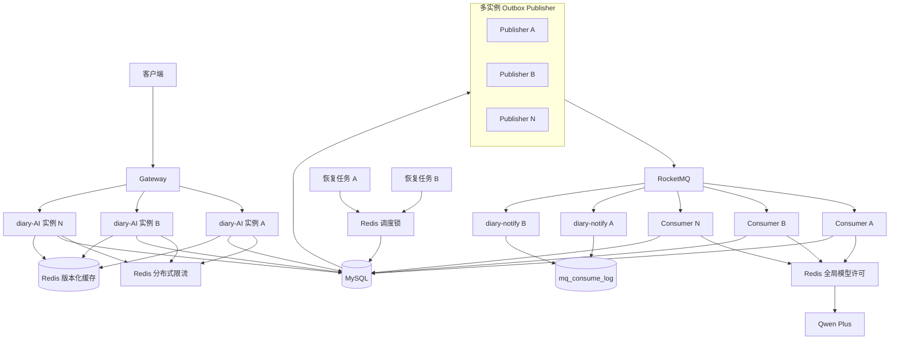

# AI 应用 RocketMQ——版本 3

> 多实例协调、分布式锁、分布式限流与集群级 AI 并发治理
>
> 文件名按照要求保留为 `AI应用RocketMq-版本2.md`，文档内容为第三版。本文以当前 Diary-Self 代码和《AI应用RocketMq-版本2-实操手册.md》为基线。

## 1. 第三版定位

第二版解决的是单个 diary-AI 实例内的可靠性：

```text
MySQL 任务状态机
    + RocketMQ 至少一次投递
    + Outbox 可靠发送
    + Redis 查询缓存和提交计数
    + 本地 Semaphore
    + 单实例恢复任务
```

第三版解决的是部署两个及以上 diary-AI 实例后出现的协调问题：

```text
多个实例同时扫描 Outbox
多个实例同时运行恢复任务
多个 Consumer 共同调用 Qwen Plus
所有实例共享用户提交额度
缓存回源与失效发生竞态
Worker 宕机、扩缩容和旧 Worker 回写
事件被多个通知实例重复处理
```

第三版的核心原则：

1. MySQL 仍是任务、Outbox 和结果的最终事实源。
2. RocketMQ 仍按“至少一次”设计，重复消息属于正常情况。
3. Redis 用于协调和流量治理，但不能代替数据库状态机与唯一约束。
4. 分布式锁只保护适合串行执行的短任务，不能包围整个模型调用。
5. 所有可能过期的所有权都要配合 fencing token、`workerId + versionId` 或条件 SQL。
6. 扩容只能提高系统处理能力，不能突破 Qwen Plus 的集群配额和费用上限。

## 2. 当前第二版代码审计结论

### 2.1 已经完成的能力

当前代码已经具备：

- `ai_task + mq_outbox` 同事务创建。
- HTTP 提交链路不再直接发送 RocketMQ。
- Outbox `NEW / SENDING / RETRY_WAIT / SENT / DEAD` 状态骨架。
- Outbox 乐观锁领取和失败退避。
- `@EnableScheduling`、Outbox Publisher 和 RUNNING Recovery Job。
- Redis 任务状态缓存、幂等映射和用户提交计数。
- 状态、结果查询接口。
- 本地 `Semaphore` 模型并发控制。
- Consumer 原子抢占、租约、`attemptCount` 和 `workerId + versionId`。
- SUCCESS 结果事务中写 Outbox 的基本结构。
- FAILED 事件 Outbox 的基本结构。

以上基础可以继续使用，不需要推倒重写。

### 2.2 P0：进入第三版前必须修复

| 问题 | 当前影响 | 必须修改 |
| --- | --- | --- |
| Publisher 在恢复数为 0 时直接返回 | 正常 `NEW / RETRY_WAIT` 消息永远不发送 | 删除 `if (cnt == 0) return` |
| `insertRetryTaskOutbox` XML 是空语句 | RUNNING 恢复无法真正创建补发消息 | 在 Java 中构造完整 `MqOutboxPO` 并调用 `insertOutbox` |
| 恢复更新失败后仍插 Outbox | 可能发送一个并未进入 RETRY_WAIT 的任务 | 只有条件更新恰好为 1 才插入 Outbox |
| 次数耗尽恢复只写 FAILED | diary-notify 收不到最终失败事件 | FAILED 与 `AI_FAILED` Outbox 同事务提交 |
| FAILED 事务内部捕获 RuntimeException | 异常被吞后事务可能提交部分数据 | 事务方法不要吞异常；失败时抛出回滚 |
| `markFailedIfOwned` 为 0 仍写失败 Outbox | 会发布虚假的 `AI_FAILED` | 先校验状态更新为 1，再写事件；二者任一失败整体回滚 |
| 成功和失败事件仍序列化 `AiTaskMessageDto` | 缺少 `eventType/resultId/errorCode` | 使用现有 `AiTaskEventDto` |
| SUCCESS/FAILED 共用 `eventTag=AI_COMPLETED` | 失败事件会使用错误 Tag | 分成 `completedTag` 和 `failedTag`，或直接用事件类型作 Tag |
| 结果 VO 的 taskId 使用营养结果主键 | API 返回错误的任务 ID | 改为 `aiTaskPO.getId()` |
| `ai_nutrient.ai_task_id` 只有普通索引 | 并发重复提交结果无法由数据库阻止 | 检查历史重复后添加唯一索引 |

对应当前代码位置：

```text
AiOutboxPublisher.java:35
AiTaskRecoveryServiceImpl.java:60
DiaryAIMapper.xml:362
AiTaskCommandServiceImpl.java:233-270
ConvertPoToVo.java:28
ai.sql:31
```

### 2.3 P1：第二版闭环问题

1. `AiSubmitRateLimiter` 未处理 Redis 返回 null，也没有明确 Redis 故障策略。
2. 幂等缓存 `evict()` 未捕获 Redis 异常，清理脏缓存时可能让正常提交失败。
3. 成功、失败、恢复后的缓存失效没有统一放到事务提交之后。
4. 当前状态缓存可能在任务 SUCCESS 后继续返回 RUNNING，直到 30 秒 TTL 到期。
5. Recovery Job 使用固定批量 50，没有配置化，也没有多实例互斥或分片。
6. `MqOutboxPO` 注释仍使用旧的 PENDING/SUCCESS/FAILED 状态，与实际枚举不一致。
7. `mq.sql` 的默认最大重试为 3，而运行配置默认为 10。
8. `ai_task` 缺少 `(status, lease_until)` 恢复扫描索引。
9. 当前没有 diary-notify 对 `AI_COMPLETED / AI_FAILED` 的消费者实现。
10. Qwen Plus 异常主要包装成 `CustomException`，但失败分类只把 `IllegalArgumentException` 当永久错误，错误分类仍需细化。

### 2.4 P2：代码质量调整

- `AiOutboxConsumer` 实际消费的是 AI 任务，建议更名为 `AiTaskConsumer`。
- `OUTBOX_AGGREGATE_TYPE_ONE` 建议改为 `AI_TASK_AGGREGATE_TYPE`。
- `FIRST_VERSION_USER_ID = 10000L` 应使用常量，后续再替换为真实登录用户。
- Publisher 每秒打印“恢复 0 条”会形成噪声日志，只在恢复数大于 0 时记录 INFO。
- Outbox 发送逻辑应提取为 `OutboxMessageProducer`，Publisher 只负责编排。
- 删除无效 TODO、未使用 import 和已经废弃的旧 Producer。

## 3. 进入第三版前的修复示例

### 3.1 修复 Publisher 阻断问题

```java
@Scheduled(fixedDelayString = "${diary.ai.rocketmq.publisher-interval-ms:1000}")
public void publishReadyMessages() {
    int recovered = aiOutboxService.recoverSendingTimeout();
    if (recovered > 0) {
        log.info("恢复超时SENDING Outbox, count={}", recovered);
    }

    // 无论 recovered 是否为 0，都必须扫描 NEW / RETRY_WAIT。
    List<MqOutboxPO> batch = diaryAiMapper.selectReadyOutbox(
            LocalDateTime.now(),
            properties.getRocketmq().getPublisherBatchSize());

    for (MqOutboxPO outbox : batch) {
        publishOne(outbox);
    }
}
```

### 3.2 修复恢复事务

```text
读取过期 RUNNING
    ↓
条件更新 RUNNING → RETRY_WAIT
    ↓ 更新行数必须为 1
构造新的 eventId 和 AiTaskMessageDto
    ↓
insert mq_outbox(NEW)
    ↓
同一个本地事务提交
```

不要使用空的 Mapper `insertRetryTaskOutbox`。复用 `insertOutbox(MqOutboxPO)`，让 payload、eventId、Topic、Tag 和重试参数都在 Java 中显式构建。

### 3.3 修复失败事务

```java
@Transactional(rollbackFor = Exception.class)
public ConsumeResult markFailedAndCreateEvent(...) {
    int failed = diaryAiMapper.markFailedIfOwned(failureRequest);
    if (failed != 1) {
        throw new IllegalStateException("FAILED状态更新失败");
    }

    MqOutboxPO eventOutbox = buildFailedEventOutbox(...);
    if (diaryAiMapper.insertOutbox(eventOutbox) != 1) {
        throw new IllegalStateException("AI_FAILED Outbox写入失败");
    }
    return ConsumeResult.SUCCESS;
}
```

事务方法内部不要 catch 后返回 FAILURE。应让异常穿透事务代理完成回滚，再由 Consumer 外层决定返回 `FAILURE`。

### 3.4 使用正确事件 DTO

```java
AiTaskEventDto event = AiTaskEventDto.builder()
        .eventId(eventId)
        .eventType(OutboxEventTypeEnum.AI_COMPLETED.name())
        .taskId(taskId)
        .userId(userId)
        .resultId(aiInfoPO.getId())
        .occurTime(now)
        .schemaVersion(1)
        .traceId(MDC.get("traceId"))
        .build();
```

失败事件填写 `errorCode / errorMessage`，不填写 `resultId`。

### 3.5 补齐数据库约束和索引

```sql
SELECT ai_task_id, COUNT(*)
FROM ai_nutrient
GROUP BY ai_task_id
HAVING COUNT(*) > 1;

ALTER TABLE ai_nutrient
    DROP INDEX idx_ai_nutrient_task_id,
    ADD UNIQUE KEY uk_ai_nutrient_task_id (ai_task_id);

ALTER TABLE ai_task
    ADD KEY idx_ai_task_status_lease (status, lease_until),
    ADD KEY idx_ai_task_status_create (status, create_time);
```

只有 P0 全部修复并完成单实例故障演练后，才开始多实例部署。

## 4. 第三版总体架构



## 5. 多实例基础约定

### 5.1 实例 ID

每个进程启动时生成唯一实例 ID：

```text
{serviceName}:{hostName/podName}:{processStartUuid}
```

实例 ID 用于 Outbox `locked_by`、任务 workerId、分布式许可、日志和优雅停机。所有 diary-AI 实例必须使用同一个任务 Consumer Group，才能共同分摊消息。

### 5.2 时间来源

- Redis 限流脚本优先使用 Redis `TIME`。
- 数据库条件判断优先使用数据库时间或统一 UTC 时间。
- Java 日志统一携带时区和毫秒。
- 监控主机 NTP 偏差。

### 5.3 Redis Key Hash Tag

```text
diary:{ai:prod}:limit:submit:user:10000
diary:{ai:prod}:limit:submit:global
diary:{ai:prod}:permit:qwen-plus
diary:{ai:prod}:job-lock:task-recovery
diary:{ai:prod}:task-cache:2000001
```

Redis Cluster 中，多 Key Lua 必须位于同一个 Hash Slot。`{ai:prod}` 是 Hash Tag；高流量后要评估单 Slot 热点。

## 6. 多实例 Outbox 协调

### 6.1 不要给整个 Publisher 加分布式锁

全局 `outbox-publisher-lock` 会让所有实例中只有一个实例发送消息，扩容没有意义。正确方式是 Outbox 行级领取：多个实例并行工作，每条记录只有一个领取者可以确认状态。

### 6.2 表结构扩展

```sql
ALTER TABLE mq_outbox
    ADD COLUMN locked_by VARCHAR(128) NULL COMMENT '领取实例',
    ADD COLUMN locked_until DATETIME(3) NULL COMMENT '领取租约截止时间',
    ADD COLUMN claim_token VARCHAR(64) NULL COMMENT '本次领取令牌',
    ADD KEY idx_outbox_claim
        (status, next_retry_time, locked_until, id);
```

`claim_token` 是 Outbox 的 fencing token。旧 Publisher 即使在租约过期后发送完成，也不能覆盖新领取者的状态。

### 6.3 推荐领取方案：MySQL 8 SKIP LOCKED

短事务内执行：

```sql
SELECT id
FROM mq_outbox
WHERE status IN ('NEW', 'RETRY_WAIT')
  AND next_retry_time <= NOW(3)
  AND (locked_until IS NULL OR locked_until < NOW(3))
ORDER BY next_retry_time, id
LIMIT 50
FOR UPDATE SKIP LOCKED;
```

随后在同一短事务内将选中记录更新为 `SENDING`，写入 `locked_by / locked_until / claim_token` 并递增版本。事务提交后再发送 RocketMQ，不能在 `FOR UPDATE` 事务中执行网络请求。

### 6.4 发送确认条件

```sql
UPDATE mq_outbox
SET status = 'SENT',
    broker_message_id = :messageId,
    sent_time = NOW(3),
    locked_by = NULL,
    locked_until = NULL,
    claim_token = NULL,
    version_id = version_id + 1
WHERE id = :id
  AND status = 'SENDING'
  AND locked_by = :instanceId
  AND claim_token = :claimToken;
```

影响行数为 0 表示本实例已失去 Outbox 所有权，不能继续修改状态。

### 6.5 Broker 成功但确认失败

此窗口无法完全消除。重发必须沿用同一 `eventId`，任务 Consumer 保持状态幂等，结果表保持 `UNIQUE(ai_task_id)`，通知 Consumer 使用 `consumer_group + event_id` 唯一约束。

### 6.6 兼容当前乐观锁领取

当前 `selectReadyOutbox + claimOutbox(versionId)` 正确修复后已经能保证只有一个实例领取成功，但各实例会重复查询相同候选行。

学习顺序：

1. 先启动两个实例验证当前乐观锁方案。
2. 再升级 `SKIP LOCKED` 批量领取。
3. 最后加入 claimToken 防止旧 Publisher 回写。

## 7. 分布式调度锁

### 7.1 使用边界

适合加锁：RUNNING 恢复扫描、SENDING 超时恢复、DEAD 告警汇总、缓存清理。不要给 Outbox 正常发布、RocketMQ 消费、完整模型调用和普通查询加全局锁。

### 7.2 推荐使用 Redisson

引入与当前 Spring Boot 版本兼容的 Redisson Starter，并在父 POM 统一管理版本。

```java
@Scheduled(fixedDelayString = "${diary.ai.task.recovery-interval-ms:30000}")
public void recoverExpiredRunning() {
    RLock lock = redissonClient.getLock(keyFactory.jobLock("task-recovery"));
    boolean acquired = false;
    try {
        acquired = lock.tryLock(0, 25, TimeUnit.SECONDS);
        if (!acquired) {
            return;
        }
        recoveryService.recoverBatch();
    } catch (InterruptedException e) {
        Thread.currentThread().interrupt();
    } finally {
        if (acquired && lock.isHeldByCurrentThread()) {
            lock.unlock();
        }
    }
}
```

锁租约应小于调度间隔并大于正常单批耗时。若批处理可能超时，应缩小批量、分批重新竞争，或使用 Watchdog。

### 7.3 锁不是最终防线

即使有 Redis 锁，恢复 SQL 仍需校验 `taskId + RUNNING + leaseUntil + versionId`。锁可能过期或发生主从切换，数据库条件更新才是最终 fencing。

## 8. 分布式提交限流

### 8.1 当前实现的能力与不足

当前固定窗口计数使用共享 Redis，多实例连接同一 Redis 时已经形成基础共享计数。但存在分钟边界突刺、缺少全局维度、Redis null/异常策略不清晰，以及应用时钟偏差。

### 8.2 第三版限流维度

一次新任务提交同时检查：

```text
用户维度：每用户每分钟任务数
服务维度：diary-AI 全集群每秒新任务数
模型维度：Qwen Plus 每秒允许启动数
费用维度：每日 Token 或调用预算
```

重复 `clientRequestId` 返回原任务，不消耗新额度。

### 8.3 原子令牌桶

Lua 在 Redis 内完成：

```text
1. 使用 Redis TIME
2. 计算用户桶和全局桶应补充的 Token
3. 任一桶不足则全部不扣减，返回拒绝和等待时间
4. 全部充足才一次性扣减
5. 更新 tokens、lastRefillTime 和 TTL
```

返回 `allowed / reason / retryAfterMs / remainingTokens`，Controller 返回 HTTP 429 和 `Retry-After`。

### 8.4 Redis Cluster

多 Key Lua 的用户桶和全局桶必须位于同一 Hash Slot，例如：

```text
diary:{ai:prod}:limit:user:10000
diary:{ai:prod}:limit:global
```

这会集中到一个 Slot。第三版先保证语义正确，达到吞吐瓶颈后再做分片。

### 8.5 Redis 故障策略

| 场景 | 推荐策略 |
| --- | --- |
| 状态缓存不可用 | fail-open，回源 MySQL |
| 幂等缓存不可用 | fail-open，依赖 MySQL 唯一约束 |
| 用户提交限流不可用 | 生产 fail-closed；开发可配置 fail-open |
| 模型全局许可不可用 | fail-closed，不调用模型 |
| 调度锁不可用 | 跳过本轮并告警 |

## 9. Qwen Plus 全局并发许可

### 9.1 本地 Semaphore 不够

每实例本地并发为 2 时，2 个实例最多 4 个调用，5 个实例最多 10 个调用。扩容会直接突破模型配额，因此第三版保留本地 Semaphore，同时增加 Redis 全局许可。

### 9.2 ZSet 租约信号量

```text
Key    = diary:{ai:prod}:permit:qwen-plus
member = {instanceId}:{taskId}:{uuid}
score  = permitExpireAtMillis
```

获取许可的 Lua 原子执行：

```text
ZREMRANGEBYSCORE key -inf now
if ZCARD key >= maxConcurrency then rejected
else ZADD key expireAt permitToken; PEXPIRE key keyTtl; acquired
```

### 9.3 获取顺序

```text
解析并校验消息
    ↓
获取本地 Semaphore
    ↓
获取 Redis 全局许可
    ↓
数据库原子抢占并增加 attemptCount
    ↓
调用模型并提交状态
    ↓
finally 释放全局许可和本地许可
```

若数据库抢占失败，立即释放全局许可。没有获得全局许可时不得增加 `attemptCount` 或进入 RUNNING。

### 9.4 续期和释放

许可租约 180 秒时，可每 60 秒续期。续期 Lua 只允许同一个 permitToken 更新 score。若连续续期失败，记录许可丢失并阻止旧 Worker 提交结果。

释放使用 `ZREM key permitToken`。Worker 宕机未释放时，许可由过期清理回收。

## 10. 数据库任务租约续期

### 10.1 当前风险

当前 Consumer 只在抢占时写一次 `leaseUntil`。模型调用超过租约时，Recovery 可能误判 Worker 已死亡并让其他实例接管。

### 10.2 心跳 SQL

```sql
UPDATE ai_task
SET lease_until = :newLeaseUntil
WHERE id = :taskId
  AND status = 'RUNNING'
  AND worker_id = :workerId
  AND version_id = :versionId;
```

租约心跳不是状态迁移，建议不增加 `version_id`。心跳影响行为 0 表示失去所有权，旧 Worker 不能提交终态。

数据库租约解决“谁能写任务结果”，Redis 许可解决“全集群最多调用几次模型”，两者不能替代。

## 11. 多实例缓存一致性

### 11.1 Cache-Aside 竞态

```text
实例 A 缓存 miss，读取旧 RUNNING
实例 B 提交 SUCCESS 并删除缓存
实例 A 在删除后写回旧 RUNNING
```

### 11.2 版本化缓存

缓存携带 `versionId`，Lua 只允许新版本覆盖旧版本。同时维护：

```text
diary:{ai:prod}:task-version:{taskId} = latestVersionId
```

状态事务提交后更新版本水位并删除或写入最新缓存。查询回填前校验水位，拒绝旧数据库快照。

### 11.3 热点重建锁

只有同一 taskId 出现大量并发 miss 时才使用 2～3 秒短 Redis 锁保护一次数据库查询和缓存写入。该锁不能包围模型调用。

### 11.4 失效时机

PENDING→QUEUED、→RUNNING、RETRY_WAIT、SUCCESS、FAILED 和 Recovery 状态迁移都在事务 `afterCommit` 后失效缓存。Redis 异常不能回滚 MySQL，但必须记录指标。

## 12. 分布式幂等

### 12.1 提交和结果

提交继续依靠 `UNIQUE(user_id, client_request_id)`，不增加分布式锁。结果依靠 `UNIQUE(ai_task_id)` 和 `workerId + versionId`。

### 12.2 通知消费幂等

```sql
CREATE TABLE mq_consume_log (
    id BIGINT UNSIGNED NOT NULL,
    consumer_group VARCHAR(128) NOT NULL,
    event_id VARCHAR(64) NOT NULL,
    message_id VARCHAR(128) NULL,
    business_key VARCHAR(128) NOT NULL,
    status VARCHAR(16) NOT NULL,
    create_time DATETIME(3) NOT NULL,
    finish_time DATETIME(3) NULL,
    PRIMARY KEY (id),
    UNIQUE KEY uk_consumer_event (consumer_group, event_id)
) ENGINE=InnoDB DEFAULT CHARSET=utf8mb4;
```

通知业务数据与消费完成记录在同一个事务中提交。不要在业务完成前永久记录“已消费”。

## 13. 锁、租约与 fencing token 边界

| 场景 | 协调方式 | 最终防线 |
| --- | --- | --- |
| Outbox 多实例领取 | SKIP LOCKED + 租约 | claimToken 条件更新 |
| Recovery Job | Redis 分布式锁 | task version + lease SQL |
| 全局模型并发 | Redis ZSet 租约信号量 | permitToken + Worker 所有权 |
| 任务执行所有权 | MySQL 租约 | workerId + versionId |
| 热点缓存重建 | 短 Redis 锁 | versionId 水位 |
| 提交幂等 | 不加锁 | MySQL 唯一索引 |
| 通知消费幂等 | 不依赖 Redis 锁 | consumerGroup + eventId 唯一索引 |

锁或租约过期后旧持有者仍可能继续运行，因此写操作必须验证所有权。

## 14. 优雅停机与实例故障

### 14.1 优雅停机

```text
1. 从注册中心摘除
2. 停止接受新 HTTP 请求
3. 停止领取新 Outbox
4. 停止接收新 MQ 消息
5. 等待在途任务到上限时间
6. 停止心跳
7. 释放本实例许可
8. 关闭线程池和连接
```

不要在停机时无条件把所有 RUNNING 改回 RETRY_WAIT，未完成任务交给租约过期恢复。

### 14.2 强制宕机恢复

- Outbox `locked_until` 过期后由其他 Publisher 领取。
- Redis 全局许可过期后清理。
- `ai_task.lease_until` 过期后由 Recovery 恢复。
- 未确认消息由 Broker 重投。
- 重复结果由状态条件和唯一索引阻止。

## 15. 第三版配置建议

```yaml
diary:
  ai:
    rocketmq:
      task-topic: diary-ai-task
      task-tag: QWEN_PLUS_NUTRIENT
      task-consumer-group: diary-ai-qwen-plus-worker-v3
      event-topic: diary-ai-event
      completed-tag: AI_COMPLETED
      failed-tag: AI_FAILED
      publisher-batch-size: 50
      publisher-interval-ms: 1000
      outbox-claim-lease-seconds: 60
      outbox-max-retries: 10
    task:
      max-attempts: 3
      execution-lease-seconds: 180
      heartbeat-interval-seconds: 60
      recovery-interval-ms: 30000
      recovery-batch-size: 50
    distributed-lock:
      task-recovery-lease-seconds: 25
      outbox-recovery-lease-seconds: 10
      cache-rebuild-lease-seconds: 3
    rate-limit:
      fail-open: false
      user-capacity: 10
      user-refill-per-minute: 10
      global-capacity: 20
      global-refill-per-second: 20
    model-permit:
      max-global-concurrency: 3
      permit-lease-seconds: 180
      renew-interval-seconds: 60
      acquire-wait-ms: 1000
      fail-open: false
    cache:
      key-prefix: diary:{ai:prod}
      running-ttl-seconds: 30
      terminal-ttl-hours: 24
      version-watermark-ttl-hours: 48
```

Consumer Group 从 v2 切换前必须明确初始消费位置。灰度阶段可继续使用原 Group，避免无意重放全部历史消息。

## 16. 可观测性

日志统一携带：

```text
instanceId traceId taskId eventId outboxId messageId consumerGroup
workerId claimToken permitToken taskVersion outboxVersion leaseUntil retryCount
```

核心指标：

- 用户/全局/模型限流拒绝数。
- 全局模型许可占用、等待和过期回收数。
- Outbox 领取、竞争失败、成功率、DEAD 和最老消息年龄。
- RUNNING 租约续期成功/失败数。
- Recovery 锁竞争、耗时和恢复数。
- 缓存命中、版本拒绝写入和重建锁等待。
- 重复消息、唯一键冲突和旧 Worker 拒绝数。
- Qwen Plus 429、超时、Token 和费用。

## 17. 实施顺序

### 阶段 0：修完第二版 P0

修复 Publisher、Recovery Outbox、失败事务、事件 DTO/Tag、结果 taskId 和数据库索引。完成单实例故障演练。

### 阶段 1：部署两个实例观察竞争

使用同一 Consumer Group；workerId 加 instanceId；先验证当前 Outbox 乐观锁和任务原子抢占。

### 阶段 2：Outbox 批量领取

加入 `locked_by / locked_until / claim_token`，实现 SKIP LOCKED 和 claimToken 回写校验。

### 阶段 3：分布式调度锁

引入 Redisson，只给恢复、清理等维护任务加锁，保留数据库条件更新。

### 阶段 4：分布式限流

升级为 Redis TIME + Lua 令牌桶，同时检查用户与全局额度，返回 retryAfter。

### 阶段 5：全局模型并发

保留本地 Semaphore，新增 Redis ZSet 许可，实现续期、释放和过期回收。

### 阶段 6：任务租约心跳

新增 `renewTaskLease`，验证长任务不误恢复、失联 Worker 可接管、旧 Worker 不可回写。

### 阶段 7：版本化缓存

新增版本水位和 Lua 比较，热点任务使用短重建锁。

### 阶段 8：通知多实例幂等

diary-notify 消费 `AiTaskEventDto`，通知数据与消费记录同事务。

### 阶段 9：故障注入与压测

覆盖发送后宕机、模型中宕机、进程暂停、Redis 故障、MySQL 慢查询、扩缩容和 MQ Lag。

## 18. 多实例测试矩阵

| 场景 | 预期结果 |
| --- | --- |
| 两个 Publisher 同时扫描 | 每条 Outbox 只有一个 claimToken 持有者 |
| Publisher A 领取后宕机 | 租约过期后 B 接管 |
| A 发送成功但确认前宕机 | B 重发同 eventId，Consumer 幂等 |
| 两个 Recovery Job 同时触发 | 只有一个获得调度锁 |
| 调度锁执行中到期 | version/lease 阻止重复状态迁移 |
| 多实例提交同 clientRequestId | 只创建一个 task 和创建事件 |
| 分钟边界高并发 | 令牌桶不产生固定窗口双倍突刺 |
| 扩容到 5 个实例 | 全局模型并发仍不超过配置 |
| Consumer 持有许可后宕机 | 许可过期自动回收 |
| 模型执行超过初始租约 | 心跳续期，不被误恢复 |
| Worker 心跳失败后返回 | workerId + versionId 阻止提交 |
| Redis 缓存 miss 风暴 | 重建锁和版本水位避免击穿及旧值覆盖 |
| Redis 缓存不可用 | 查询回源 MySQL |
| Redis 许可不可用 | 不调用模型，MQ 保持积压 |
| AI_COMPLETED 重复投递 | notify 只生成一条通知 |
| 实例优雅停机 | 不领新任务，在途任务完成或租约恢复 |

## 19. 第三版验收标准

1. 第二版 P0 问题全部修复并有测试。
2. 至少两个 diary-AI 实例同时运行。
3. 所有实例使用相同任务 Consumer Group。
4. Outbox 多实例并行领取，不使用全局 Publisher 锁。
5. Outbox 旧领取者无法覆盖新领取者。
6. Recovery 使用分布式锁，数据库仍校验 version 和 lease。
7. 用户和全局提交速率在多实例下统一受控。
8. 限流使用 Redis 时间并有降级策略。
9. Qwen Plus 全集群并发不超过上限。
10. 全局许可支持续期、释放和宕机回收。
11. RUNNING 数据库租约支持心跳。
12. 旧 Worker 失去租约后不能提交结果。
13. 缓存不能被低 versionId 的旧查询覆盖。
14. `UNIQUE(ai_task_id)` 阻止重复营养结果。
15. `consumer_group + event_id` 阻止重复通知。
16. 实例宕机、Redis 异常和 Broker 重投都有恢复路径。
17. 日志可串联 instanceId、taskId、eventId、claimToken 和 permitToken。
18. 压测给出安全实例数、Consumer 并发和模型并发配置。

## 20. 最重要的学习结论

第三版不是“到处加 Redis 锁”，而是选择正确的协调工具：

```text
业务事实与状态迁移       → MySQL 条件更新和唯一约束
消息异步传递             → RocketMQ 至少一次投递
数据库与消息最终一致     → Outbox
多实例批量工作分配       → SKIP LOCKED / 行级租约
少量维护任务互斥         → Redis 分布式锁
全集群速率控制           → Redis Lua 令牌桶
全集群并发控制           → Redis 租约信号量
旧持有者隔离             → fencing token / versionId
查询性能                 → Redis 版本化缓存
重复事件处理             → 数据库消费幂等记录
```

只有理解锁会过期、消息会重复、缓存会过时、实例会宕机，才能把多实例系统做成可恢复、可观察和可验证的系统。
