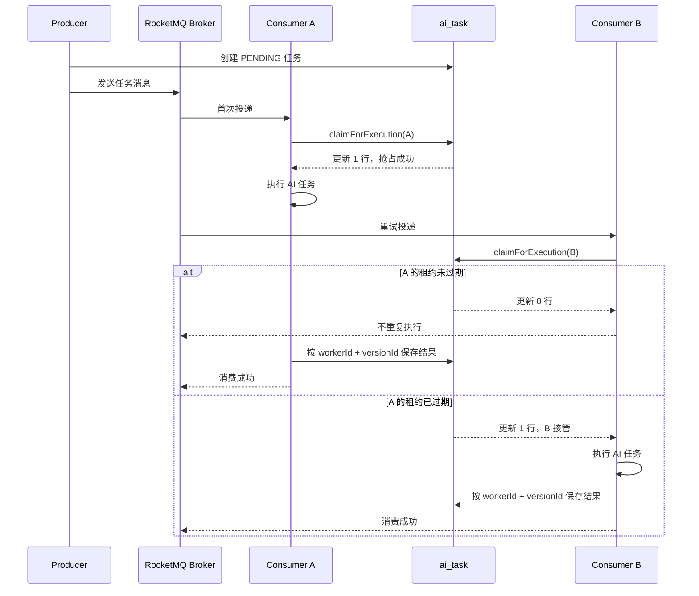

# RocketMQ 中消息与消费关系

## 1. 核心角色

- **Producer（生产者）**：创建 AI 任务，将任务消息发送到 RocketMQ。
- **Broker**：存储和投递消息，并在消费失败时按策略重试。
- **Consumer（消费者）**：接收消息，抢占对应的数据库任务，调用 AI 并保存结果。
- **Consumer Group（消费者组）**：同一组内的多个消费者共同分担消息。

## 2. 一条消息与多个消费者的关系

在同一个 Consumer Group 内，一条消息正常情况下只会被分配给其中一个消费者：

```text
Producer 发送消息
        ↓
      Broker
        ↓
Consumer Group 中的 Consumer A
```

Consumer B、Consumer C 不会每时每刻去抢同一条消息，它们通常会处理组内分配给自己的其他消息。

Consumer 只有在实际收到某条消息时，才会尝试抢占该消息对应的数据库任务。

> 如果是不同的 Consumer Group，则每个 Group 都可以独立消费这条消息。

## 3. 为什么同一条消息可能被重复投递

RocketMQ 提供的通常是“至少投递一次”语义，因此业务上必须接受消息可能重复到达。常见原因包括：

- Consumer 执行超时或返回消费失败。
- Consumer 执行完成后，确认结果没有成功到达 Broker。
- Consumer 处理期间宕机、重启或网络中断。
- Producer 因超时等原因重复发送。
- 补偿程序或管理人员重新投递任务。

因此，不能只依靠 RocketMQ 保证同一业务任务绝对只执行一次，Consumer 本身也必须实现幂等和任务所有权控制。

## 4. 数据库任务抢占

Consumer 收到消息后，会通过 `claimForExecution` 执行一条带条件的原子更新：

```sql
UPDATE ai_task
SET status = 'RUNNING',
    worker_id = #{workerId},
    lease_until = #{leaseUntil},
    attempt_count = attempt_count + 1,
    version_id = version_id + 1
WHERE id = #{taskId}
  AND user_id = #{userId}
  AND client_request_id = #{clientRequestId}
  AND attempt_count < max_attempts
  AND (
        status IN ('PENDING', 'QUEUED', 'RETRY_WAIT')
        OR (status = 'RUNNING' AND lease_until < #{startTime})
  );
```

多个 Consumer 同时尝试抢占时，数据库的行锁和条件更新会决定胜者：

```text
Consumer A：更新 1 行 → 抢占成功 → 执行 AI 任务
Consumer B：更新 0 行 → 抢占失败 → 不执行 AI 任务
```

数据库抢占是 RocketMQ 投递之后的第二道保险，主要用于处理重复投递、并发重试和故障恢复。

## 5. 租约的作用

Consumer 抢占成功后，任务记录可能是：

```text
status        = RUNNING
worker_id     = consumer-A
lease_until   = 10:05
attempt_count = 1
version_id    = 1
```

`lease_until` 表示 Consumer A 拥有任务执行权的截止时间。

### 租约未过期

如果 Consumer B 在 10:02 收到重复消息：

```text
lease_until < 当前时间
10:05 < 10:02 → false
```

Consumer B 更新 0 行，不能接管，任务仍由 Consumer A 执行。

### 租约已过期

如果 Consumer A 宕机或长时间无响应，Consumer B 在 10:06 收到重投消息：

```text
lease_until < 当前时间
10:05 < 10:06 → true
```

Consumer B 可以重新抢占任务：

```text
status        = RUNNING
worker_id     = consumer-B
lease_until   = 10:11
attempt_count = 2
version_id    = 2
```

允许抢占过期的 `RUNNING` 任务，是为了避免原 Consumer 宕机后任务永久卡在 `RUNNING`。

## 6. `workerId` 和 `versionId` 的作用

租约过期不代表原 Consumer 一定已经停止。它也可能只是执行较慢：

```text
10:00  A 抢占成功，versionId = 1
10:05  A 的租约过期
10:06  B 接管任务，versionId = 2
10:07  A 恢复并尝试保存成功结果
```

结果更新必须同时校验当前所有者和版本：

```sql
UPDATE ai_task
SET status = 'SUCCESS'
WHERE id = #{taskId}
  AND status = 'RUNNING'
  AND worker_id = #{workerId}
  AND version_id = #{versionId};
```

此时 A 的 `workerId` 和 `versionId` 已经过期，更新 0 行，不能覆盖 B 的任务状态。

- `workerId`：标识当前任务属于哪个执行者。
- `leaseUntil`：避免执行者宕机后永久占有任务。
- `versionId`：防止旧执行者覆盖新执行者的结果。
- `attemptCount`：限制任务总尝试次数。

## 7. 消费成功与失败

Consumer 的处理结果会影响 Broker 是否重投：

- 执行成功：将数据库任务改为 `SUCCESS`，向 Broker 返回消费成功。
- 可重试失败：将任务改为 `RETRY_WAIT`，向 Broker 返回消费失败，等待重投。
- 永久失败或尝试次数耗尽：将任务改为 `FAILED`，确认消息，避免无意义重试。
- 重复消息遇到 `SUCCESS`/`FAILED` 终态：直接确认，不再调用 AI。
- 数据库暂时异常：返回消费失败，交给 Broker 重试。

## 8. 消息入口为什么需要校验

Consumer 会校验：

- `taskId`、`userId` 是否存在。
- `clientRequestId` 是否有效。
- `schemaVersion` 是否是当前消费者支持的协议版本。
- `taskType` 是否属于当前消费者。

这不是因为消息在传输中会悄悄丢失某个字段，而是为了防范：

- 生产者代码发送了不完整的消息。
- 新旧版本服务在滚动发布期间协议不兼容。
- 其他服务配错 Topic 或 Tag。
- 测试脚本、管理后台或补偿程序发送了错误消息。

## 9. 完整时序



## 10. 需要特别注意的边界

### 10.1 租约过期不会让旧 Consumer 自动停止

旧 Consumer 可能只是执行较慢。新 Consumer 接管后，两者可能在短时间内同时调用 AI。

`workerId + versionId` 可以防止旧 Consumer 写回数据库，但不能撤销已经发出的外部 AI 请求，因此租约时间应明显大于正常执行时间，长任务应考虑定期续租。

### 10.2 租约过期不会自动触发新 Consumer

只有 Consumer 收到消息或补偿程序主动处理时，才会执行 `claimForExecution`。如果原 Consumer 宕机后没有后续重投，仅靠 `lease_until` 字段不会自动恢复任务。

系统应增加定时补偿：

1. 扫描已过期的 `RUNNING` 任务。
2. 将其转换为 `RETRY_WAIT`。
3. 重新投递任务消息。
4. 尝试次数耗尽时将任务收敛为 `FAILED`。

## 11. 总结

```text
RocketMQ       负责存储、分配和重试投递消息
数据库条件更新  负责决定哪个 Consumer 可以执行任务
workerId       负责识别当前任务所有者
leaseUntil     负责在所有者宕机后释放执行权
versionId      负责防止旧 Consumer 覆盖新 Consumer 的结果
attemptCount   负责限制总重试次数
```

整体思路是：**MQ 负责把消息交给某个 Consumer，数据库负责判定该 Consumer 是否真正拥有这个业务任务的执行权。**
