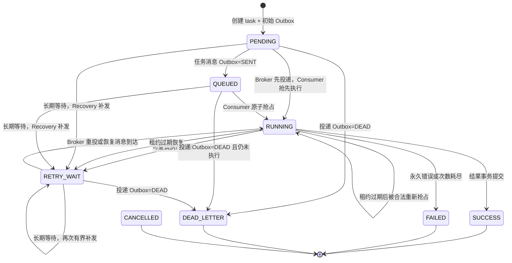
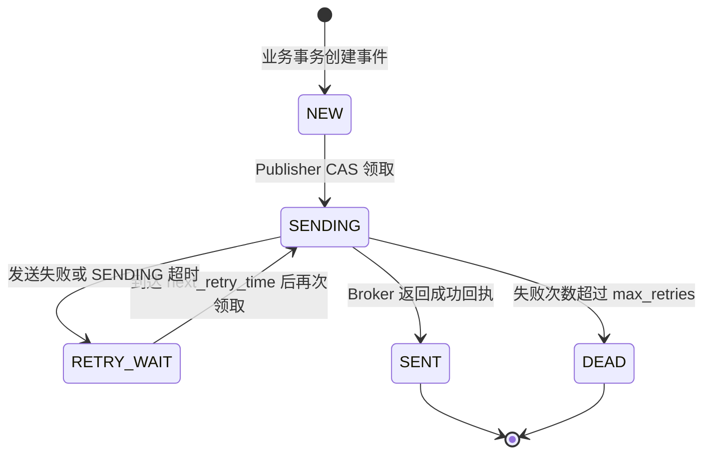
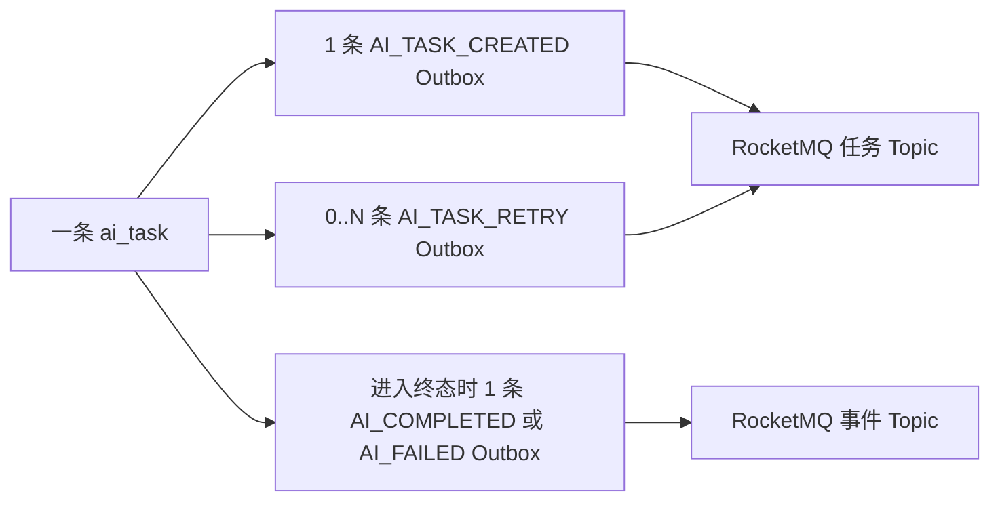

# diary-AI 模块状态流转终版说明

> 文档状态：终版（以 2026-09-01 当前工作区代码为准）  
> 适用范围：`diary-AI` 当前单应用实例版本  
> 核心主题：`ai_task` 业务状态、`mq_outbox` 投递状态以及二者的联动边界

## 1. 结论先行

`ai_task` 与 `mq_outbox` 是两套不同维度的状态机，不能逐项对应，也不能用其中一张表替代另一张表：

- `ai_task.status` 表示 AI 任务本身是否待处理、执行中、成功或失败，是客户端查询任务进度的业务事实。
- `mq_outbox.status` 表示某一条事件是否已发送到 RocketMQ，是可靠投递事实。
- 一个 AI 任务会对应多条 Outbox：初始任务事件、零到多条恢复事件，以及一条成功或失败终态事件。
- `Outbox=SENT` 只表示 Broker 已接收消息，不表示 Consumer 已处理，更不表示 AI 任务成功。
- `ai_task=SUCCESS` 也不保证完成事件已经投递成功；此时 `AI_COMPLETED` Outbox 仍可能处于 `NEW/SENDING/RETRY_WAIT/DEAD`。

当前方案采用“本地事务 + Outbox + RocketMQ 至少一次投递 + 数据库条件更新”的最终一致性模型，不是全局事务。

## 2. 当前版本边界

本项目当前不建设分布式应用版本。原因是现阶段业务数据量、任务量和并发储备尚不足以支撑多实例改造成本。

本版约定：

- `diary-AI` 按单应用实例运行理解和维护。
- 保留现有 `version_id`、`worker_id`、执行租约和本地并发控制。这些机制在单实例下仍用于防止 RocketMQ 重复投递、进程卡死、旧执行覆盖新结果，并不代表准备部署多实例。
- 不引入分布式调度锁、全局模型信号量、多实例缓存一致性协议、批量分布式 Outbox 领取等设计。
- 项目中的 `AI应用RocketMq-版本3.md` 属于历史储备方案，不是当前实施目标；状态判断以本文和当前代码为准。

## 3. 模块职责与主要组件

| 层次 | 主要组件 | 职责 |
| --- | --- | --- |
| API | `DiaryAIController` | 提交任务、查询状态、查询结果 |
| 应用编排 | `AiTaskApplicationServiceImpl` | 参数规范化、幂等校验、提交限流、创建任务 |
| 事务命令 | `AiTaskCommandServiceImpl` | 创建任务与 Outbox、提交成功结果、记录失败终态 |
| Outbox 发布 | `AiOutboxPublisher`、`AiOutboxServiceImpl` | 扫描、领取、发送、确认、退避重试和死亡处理 |
| MQ 消费 | `AiOutboxConsumer` | 校验任务消息、本地并发保护、任务抢占、ACK/重试决策 |
| AI 执行 | `AiTaskExecutor`、`AIFactory`、`InvokeQwenPlus` | 解析输入快照、选择模型策略、调用模型并保存结果 |
| 故障恢复 | `AiTaskRecoveryJob`、`AiTaskRecoveryServiceImpl` | 恢复过期 `RUNNING`，补发长期停留的等待态任务 |
| 运行保护 | `LocalAiConcurrencyGuard`、`AiTaskLeaseRenewer` | 单实例模型并发限制、执行期间续租 |
| 查询缓存 | `AiTaskCacheServiceImpl` | Redis Cache-Aside；MySQL 始终是权威数据源 |
| 持久化 | `DiaryAiMapper.xml` | 用带前置状态、所有权和版本条件的 SQL 实现状态迁移 |

当前实际启用的模型策略只有 `InvokeQwenPlus`；其他模型类仍为注释代码。

## 4. 两张核心表的职责

### 4.1 `ai_task`：业务任务主表

核心字段：

| 字段 | 含义 |
| --- | --- |
| `status` | 任务业务状态 |
| `attempt_count` | 成功抢占并进入执行流程的次数，不是 RocketMQ 投递次数 |
| `max_attempts` | 最大模型执行次数，默认 3 |
| `recovery_count` | 等待态任务已生成的补发消息数，不是模型执行次数 |
| `worker_id` | 当前执行者标识 |
| `lease_until` | `RUNNING` 所有权有效期 |
| `version_id` | 任务状态迁移的乐观锁版本 |
| `queue_time` | 首次确认进入 Broker，或首次抢占时补写的时间 |
| `start_time` | 首次开始执行时间，后续重试不覆盖 |
| `finish_time` | 成功或最终失败时间 |
| `error_code/error_message` | 最近一次错误或恢复原因 |
| `client_request_id/request_hash` | 提交幂等键及规范化请求指纹 |

### 4.2 `mq_outbox`：事件投递记录

核心字段：

| 字段 | 含义 |
| --- | --- |
| `event_id` | 全局唯一事件 ID，同时写入消息 payload |
| `aggregate_id` | 对应的 `ai_task.id` |
| `event_type` | 创建、恢复、完成或失败事件 |
| `status` | 当前这条事件的发送状态 |
| `retry_count/max_retries` | 当前事件的发送失败次数与允许重试次数 |
| `next_retry_time` | Publisher 下次可领取时间 |
| `broker_message_id` | Broker 接收成功后返回的消息 ID |
| `last_error` | 最近一次发送错误 |
| `version_id` | Outbox 领取和状态更新的乐观锁版本 |

三个计数器必须分开理解：

| 计数器 | 所属 | 何时增加 | 控制什么 |
| --- | --- | --- | --- |
| `attempt_count` | `ai_task` | Consumer 成功把任务抢占为 `RUNNING` | 模型最多执行多少次 |
| `recovery_count` | `ai_task` | Recovery 为长期等待任务创建补发 Outbox | 最多自动补发多少代任务消息 |
| `retry_count` | 单条 `mq_outbox` | 该条事件发送失败或 `SENDING` 超时 | 该条事件最多重发多少次 |

RocketMQ 自身的消费重投次数没有写入这三个字段。

## 5. `ai_task` 状态机

### 5.1 状态定义

| 状态 | 是否终态 | 含义 |
| --- | --- | --- |
| `PENDING` | 否 | 任务和初始 Outbox 已在同一本地事务创建，尚未确认消息进入 Broker |
| `QUEUED` | 否 | 任务投递类 Outbox 已收到 Broker 成功回执 |
| `RUNNING` | 否 | Consumer 已成功抢占任务，模型调用正在执行 |
| `RETRY_WAIT` | 否 | 执行失败后等待 MQ 重投，或恢复程序已准备补发消息 |
| `SUCCESS` | 是 | 结果数据、任务成功状态和完成事件 Outbox 已在同一事务提交 |
| `FAILED` | 是 | 永久错误或执行次数耗尽；失败状态和失败事件 Outbox 已在同一事务提交 |
| `DEAD_LETTER` | 是 | 任务投递类 Outbox 发送重试耗尽，且任务仍处于等待态 |
| `CANCELLED` | 是 | 枚举预留状态；当前没有取消接口和实际迁移 SQL |

### 5.2 状态图



### 5.3 状态迁移约束

所有关键迁移都由 SQL 检查前置条件，Java 层必须检查受影响行数是否为 1：

- 抢占执行：仅允许 `PENDING/QUEUED/RETRY_WAIT`，或租约已过期的 `RUNNING`；同时要求 `attempt_count < max_attempts`。
- 提交成功、记录执行失败：必须匹配 `RUNNING + worker_id + version_id`，旧 Worker 不能覆盖新 Worker。
- 租约续期：必须匹配 `RUNNING + worker_id + version_id`，续期不增加版本号。
- Producer 确认消息发送成功时，只能把 `PENDING/RETRY_WAIT` 改成 `QUEUED`，不能把 `RUNNING` 或终态倒退为 `QUEUED`。
- 投递死信只允许把 `PENDING/QUEUED/RETRY_WAIT` 改成 `DEAD_LETTER`，不能覆盖已经开始执行或已经完成的任务。

## 6. `mq_outbox` 状态机

### 6.1 状态定义

| 状态 | 含义 |
| --- | --- |
| `NEW` | 新事件已写入数据库，等待 Publisher 扫描 |
| `SENDING` | Publisher 已通过 `id + version_id` 领取，正在进行网络发送 |
| `RETRY_WAIT` | 发送失败，已计算下一次可发送时间 |
| `SENT` | RocketMQ Broker 已返回成功回执 |
| `DEAD` | 该条事件的发送重试预算已耗尽 |

### 6.2 状态图



`max_retries` 的含义是“首次发送失败后允许重试的次数”。默认值为 10，因此单条事件最多尝试发送 11 次。退避时间从约 5 秒开始指数增长，并带 0～3 秒随机抖动，上限约 603 秒。

`SENDING` 超时表示发送结果未知：Broker 可能已经收到，只是应用没有成功记录回执。当前实现会消耗一次重试预算并重新发送，因此系统接受重复消息，依靠 Consumer 的任务状态 CAS 避免重复模型执行。

## 7. Outbox 事件类型与任务状态关系

| 事件类型 | Topic/Tag | 创建时任务状态 | `SENT` 对任务的影响 | `DEAD` 对任务的影响 |
| --- | --- | --- | --- | --- |
| `AI_TASK_CREATED` | 任务 Topic / 任务 Tag | `PENDING` | 若仍为 `PENDING/RETRY_WAIT`，改为 `QUEUED` | 若仍是等待态，改为 `DEAD_LETTER` 并创建 `AI_FAILED` Outbox |
| `AI_TASK_RETRY` | 任务 Topic / 任务 Tag | `RETRY_WAIT` | 若仍为 `PENDING/RETRY_WAIT`，改为 `QUEUED` | 若仍是等待态，改为 `DEAD_LETTER` 并创建 `AI_FAILED` Outbox |
| `AI_COMPLETED` | 事件 Topic / `AI_COMPLETED` | 已在同一事务改为 `SUCCESS` | 不修改任务 | 不修改任务，任务仍为 `SUCCESS` |
| `AI_FAILED` | 事件 Topic / `AI_FAILED` | 已在同一事务改为 `FAILED` 或 `DEAD_LETTER` | 不修改任务 | 不修改任务，任务保留原终态 |

关键关系如下：



当前仓库中没有 `diary-ai-event` 的下游 Consumer；完成/失败事件已经可靠生产，但尚未在本项目内形成通知消费闭环。

## 8. 正常成功链路

1. 客户端调用 `POST /ai/tasks`。
2. 应用完成参数规范化、幂等校验和提交限流。
3. 同一 MySQL 事务插入：
   - `ai_task=PENDING`；
   - `AI_TASK_CREATED Outbox=NEW`。
4. Publisher 扫描 `NEW/RETRY_WAIT`，CAS 更新为 `SENDING`。
5. Publisher 同步发送 RocketMQ：
   - Broker 成功后，Outbox 改为 `SENT`；
   - 若任务仍在等待，任务改为 `QUEUED`。
6. Consumer 收到消息，先获取本地并发许可，再原子抢占任务：
   - 任务改为 `RUNNING`；
   - `attempt_count + 1`；
   - 写入 `worker_id/lease_until`；
   - `version_id + 1`。
7. 执行期间按租约时长的约三分之一周期续租。
8. 模型成功返回后，在同一事务中：
   - 插入 `ai_info`；
   - 插入 `ai_nutrient`；
   - 将任务按所有权条件更新为 `SUCCESS`；
   - 插入 `AI_COMPLETED Outbox=NEW`。
9. Consumer 返回 `SUCCESS`，ACK 当前任务消息。
10. Publisher 后续把完成事件发送到事件 Topic；其发送结果不再改变任务的 `SUCCESS` 状态。

Broker 可能在 Producer 写入 `SENT/QUEUED` 前就把消息交给 Consumer，因此短暂出现以下组合是合法的：

- `ai_task=RUNNING`，初始 Outbox 仍为 `SENDING`；
- `ai_task=SUCCESS`，初始 Outbox 仍为 `SENDING`；
- `ai_task=SUCCESS`，完成事件 Outbox 为 `NEW/RETRY_WAIT/DEAD`。

## 9. 执行失败与 MQ 重投

### 9.1 可重试执行错误

普通运行异常按可重试错误处理：

1. 条件更新 `RUNNING -> RETRY_WAIT`，清空 Worker 和租约，记录错误。
2. Consumer 返回 `FAILURE`，依赖 RocketMQ 对原消息重投。
3. 此时不会立即创建新的 `AI_TASK_RETRY` Outbox。
4. 重投消息再次到达后，任务可从 `RETRY_WAIT` 抢占为 `RUNNING`，`attempt_count + 1`。

### 9.2 永久错误或执行次数耗尽

- `IllegalArgumentException` 被视为永久错误，包括持久化输入快照无法反序列化。
- `attempt_count >= max_attempts` 时不再执行模型。
- 任务更新为 `FAILED` 与创建 `AI_FAILED Outbox=NEW` 位于同一事务。
- Consumer ACK 当前消息，后续重复消息看到终态后也直接 ACK。

### 9.3 本地并发已满

Consumer 在抢占任务前获取本地 `Semaphore`。获取失败时直接返回 `FAILURE`：

- 任务状态不变；
- `attempt_count` 不增加；
- 由 RocketMQ 稍后重投。

## 10. 两类自动恢复

### 10.1 过期 `RUNNING` 恢复

Recovery Job 默认每 30 秒扫描租约已过期的 `RUNNING`：

- 尚有执行次数：同一事务执行 `RUNNING -> RETRY_WAIT`，并创建 `AI_TASK_RETRY Outbox=NEW`。
- 执行次数已耗尽：同一事务执行 `RUNNING -> FAILED`，并创建 `AI_FAILED Outbox=NEW`。
- 如果迟到的原消息先到达，也可直接重新抢占租约已过期的 `RUNNING`，不必等待 Recovery Job。

正常长任务通过租约续期避免被误恢复。即使旧 Worker 最终返回，提交结果时也必须匹配 `worker_id + version_id`，因此不能覆盖新执行者。

### 10.2 长期等待任务恢复

Recovery Job 还会扫描长期停留的 `PENDING/QUEUED/RETRY_WAIT`。默认等待 600 秒后才检查：

1. 如果仍存在状态为 `NEW/SENDING/RETRY_WAIT` 的任务投递 Outbox，说明正常投递链路仍可推进，不补发。
2. 如果没有活跃投递 Outbox，且模型执行次数未耗尽，则：
   - 任务统一改为 `RETRY_WAIT`；
   - `recovery_count + 1`；
   - 同一事务创建一条新的 `AI_TASK_RETRY Outbox=NEW`。
3. 默认最多自动生成 3 条等待态恢复消息。

特别注意：达到 `waiting_max_recovery_messages` 后，当前代码不会仅凭“消息一直没被消费”把任务改为 `DEAD_LETTER`，因为 Outbox 的 `SENT` 只能证明 Broker 已接收，任务可能只是积压。最后一次补发后任务保留在等待态，记录 `DISPATCH_RECOVERY_EXHAUSTED`，等待迟到消息或人工排查 Consumer Lag/DLQ。

只有任务投递类 Outbox 自身发送失败并最终进入 `DEAD` 时，系统才会尝试把仍未执行的任务改成 `DEAD_LETTER`。

## 11. Outbox 发送失败和死亡链路

1. `SENDING` 发送失败，或超过默认 60 秒没有完成确认。
2. 增加该 Outbox 的 `retry_count`。
3. 未超预算：`SENDING -> RETRY_WAIT`，写入 `next_retry_time/last_error`。
4. 超过预算：`SENDING -> DEAD`。
5. 如果死亡的是 `AI_TASK_CREATED/AI_TASK_RETRY`：
   - 任务仍为 `PENDING/QUEUED/RETRY_WAIT`：同一事务改为 `DEAD_LETTER`，再创建 `AI_FAILED Outbox=NEW`；
   - 任务已经 `RUNNING` 或终态：不覆盖任务，只保留死亡 Outbox 供排查。
6. 如果死亡的是 `AI_COMPLETED/AI_FAILED`：不修改任务业务终态。

`SENT` Outbox 默认保留 7 天后分批删除；`DEAD` 不自动删除，必须保留用于告警、排查和人工处理。

## 12. 事务边界与一致性保证

| 原子事务 | 同时提交的内容 | 保证 |
| --- | --- | --- |
| 任务创建事务 | `ai_task=PENDING` + `AI_TASK_CREATED Outbox=NEW` | 不出现有任务无初始消息，或有消息无任务 |
| 成功结果事务 | `ai_info` + `ai_nutrient` + `ai_task=SUCCESS` + `AI_COMPLETED Outbox=NEW` | 结果、成功状态和完成事件不可拆分 |
| 最终失败事务 | `ai_task=FAILED/DEAD_LETTER` + `AI_FAILED Outbox=NEW` | 失败终态和失败事件不可拆分 |
| 恢复事务 | `ai_task=RETRY_WAIT` + `AI_TASK_RETRY Outbox=NEW` | 不出现只改重试状态却没有补发消息 |
| 发送确认事务 | `mq_outbox=SENT` + 等待态任务尽力更新为 `QUEUED` | Broker 回执落库后推进排队状态，不覆盖新状态 |

RocketMQ 网络调用不在 MySQL 事务中，因此无法实现 Broker 与数据库的原子提交。系统明确接受以下情况：

- Broker 已收消息，但应用确认失败：Outbox 超时后会重发，可能产生重复消息。
- 数据库先创建 Outbox，但服务随即宕机：Publisher 重启后继续扫描发送。

Consumer 通过任务状态、执行次数、Worker 所有权和版本条件实现业务幂等；`ai_nutrient.ai_task_id` 的唯一索引进一步阻止同一任务保存重复结果。

## 13. 缓存、幂等与查询语义

- 提交幂等最终依赖 MySQL 唯一索引 `(user_id, client_request_id)`。
- 相同幂等键但规范化请求指纹不同会抛出幂等冲突，不能误复用旧任务。
- Redis 幂等缓存和状态缓存都只是旁路优化；缓存异常不会回滚已提交的 MySQL 事务。
- 状态变更前后会主动清理任务缓存；Recovery 使用事务提交后的事件清理缓存。
- 查询结果接口：`SUCCESS/FAILED/CANCELLED/DEAD_LETTER` 返回 HTTP 200；处理中状态返回 HTTP 202，业务结果看响应体中的 `status`。

## 14. 默认运行参数

下表来自 `AiTaskProperties` 和定时任务注解，是代码默认值；Nacos 可在运行时覆盖，实际生产值应以配置中心为准。

| 参数 | 默认值 | 含义 |
| --- | ---: | --- |
| Publisher 周期 | 1 秒 | 扫描可发送 Outbox |
| Publisher 批次 | 20 | 单轮最多处理事件数 |
| `SENDING` 超时 | 60 秒 | 发送结果未知后的恢复阈值 |
| Outbox 最大重试 | 10 | 首次发送之外允许的重试次数 |
| `SENT` 保留期 | 7 天 | 到期后分批清理 |
| 任务最大执行次数 | 3 | `attempt_count` 上限 |
| 执行租约 | 330 秒 | 单次 Worker 所有权时长 |
| 租约续期周期 | 约 110 秒 | 执行租约的三分之一 |
| Recovery 周期 | 30 秒 | 扫描执行超时和等待态任务 |
| 等待态恢复阈值 | 600 秒 | 停留超过该时间才考虑补发 |
| 等待态最大补发数 | 3 | `recovery_count` 上限 |
| Recovery 批次 | 50 | 单轮各类扫描上限 |
| 本地模型并发 | 2 | 单实例 `Semaphore` 许可数 |
| 本地许可等待 | 1000 毫秒 | 超时后让 MQ 重投 |

## 15. 排障时的判断顺序

发现任务长期不结束时，先查 `ai_task`，再查该任务的全部 Outbox，而不是只看最新一条：

```sql
SELECT id, status, attempt_count, max_attempts, recovery_count,
       worker_id, lease_until, error_code, error_message,
       create_time, update_time, version_id
FROM ai_task
WHERE id = ?;

SELECT id, event_id, event_type, status, retry_count, max_retries,
       next_retry_time, broker_message_id, last_error,
       create_time, update_time, version_id
FROM mq_outbox
WHERE aggregate_type = 'AI-TASK'
  AND aggregate_id = ?
ORDER BY create_time, id;
```

| 现象 | 重点判断 |
| --- | --- |
| `PENDING` 很久 | 初始 Outbox 是否还在 `NEW/SENDING/RETRY_WAIT`，Publisher 是否工作 |
| `QUEUED` 很久 | Broker Consumer Lag、消费组、DLQ，以及 `recovery_count` 是否到上限 |
| `RUNNING` 很久 | `lease_until` 是否持续续期；模型调用是否卡住；Recovery 是否工作 |
| `RETRY_WAIT` 很久 | RocketMQ 是否仍在重投；是否存在活跃投递 Outbox；执行次数是否耗尽 |
| `DEAD_LETTER` | 对应任务投递 Outbox 的 `last_error` 和发送重试过程 |
| `SUCCESS` 但下游没收到 | 查询 `AI_COMPLETED` Outbox，任务成功与完成事件投递是两件事 |
| `FAILED` 但下游没收到 | 查询 `AI_FAILED` Outbox，确认是否 `DEAD` |

## 16. 当前已知边界与未实现项

- `userId` 在提交和查询服务中仍固定为 `10000L`，尚未接入真实 JWT 用户上下文。
- `CANCELLED` 仅存在于枚举，没有取消接口、取消迁移和取消事件。
- `diary-ai-event` 当前没有仓库内下游 Consumer，终态事件的业务消费尚未落地。
- 等待态补发耗尽后保留等待态，当前没有人工重放/人工终止管理接口。
- 无效且无法解析到任务的 MQ 消息只能依赖 RocketMQ 有限重试和 DLQ，不能更新具体 `ai_task`。
- 当前单实例调度任务没有分布式锁，这是本阶段的明确边界，不作为缺陷处理。
- 实际运行配置来自可选 Nacos 配置，代码仓库只能确认默认值，不能代表线上最终值。

## 17. 维护规则

后续修改状态机时，应同时更新以下内容：

1. `AiTaskStatusEnum` 或 `OutboxStatusEnum`；
2. `DiaryAIMapper.xml` 的前置状态和版本条件；
3. 业务事务内对应 Outbox 事件；
4. Recovery 扫描范围和终止条件；
5. 缓存失效时机；
6. 本文中的状态图、关系矩阵和排障说明；
7. 对应的 Mapper 解析测试与服务单元测试。

状态机设计的最终原则是：任务状态只描述业务执行，Outbox 状态只描述单条事件投递；二者只通过明确的事务节点联动，任何异步回调都不能无条件覆盖更新后的任务状态。
