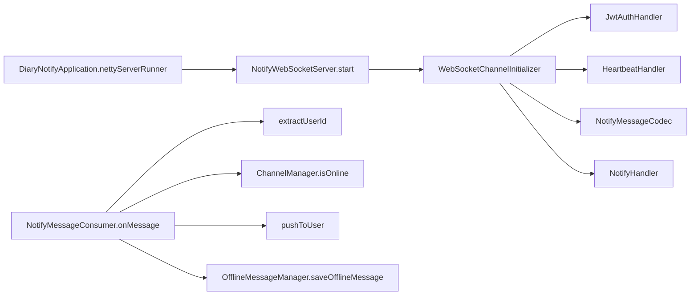
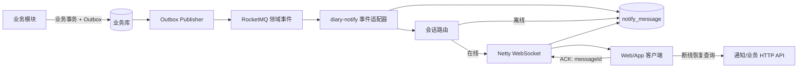

# Netty 在 Diary-Self 项目中的后续应用

> 更新日期：2026-09-09
>
> 分析方式：使用 CodeGraph 对当前仓库建立索引并追踪关键调用关系，再结合源码核对。
>
> CodeGraph 索引规模：558 个文件、8,168 个符号节点、14,550 条关系边。

## 一、结论

Diary-Self 已经在 `diary-notify` 中引入 Netty，并搭建了 WebSocket 服务端、Pipeline、JWT 处理器、心跳、消息编解码、Channel 管理、RabbitMQ 消费和离线消息等结构。因此，后续最合理的方向不是再创建一套 Netty 服务，而是先把现有实时通知链路补完整，再让 AI、文件、目标、饮食、恋爱纪念日和 XXL-Job 等模块通过领域事件复用它。

推荐优先级如下：

| 优先级 | 应用方向 | 与当前项目的契合度 | 建议 |
| --- | --- | --- | --- |
| P0 | 补全 `diary-notify` 单机通知闭环 | 极高 | 立即实施；这是其他场景的基础 |
| P1 | AI 任务完成/失败实时推送 | 极高 | 直接消费现有 RocketMQ 终态事件 |
| P1 | 视频/图片异步处理进度与结果推送 | 高 | Netty 只传进度和结果，不传文件字节 |
| P1 | 目标、饮食、纪念日、天气及任务告警 | 高 | XXL-Job 负责触发，MQ 负责解耦，Netty 负责在线送达 |
| P2 | 实时仪表盘和跨页面数据失效通知 | 中高 | 推送“小事件”，前端按需重新查询 |
| P2 | 多设备在线与多实例水平扩容 | 中高 | 单机闭环稳定后再做 |
| P3 | 智能设备 TCP 数据接入 | 条件性高 | 仅在真实接入手环、体重秤等设备时单独建设 |
| P3 | 共享日记/共享目标实时协作 | 条件性中 | 需要先确认多人协作产品需求 |
| 不建议 | 用自研 Netty RPC 替换 HTTP/Feign | 低 | 维护成本远大于当前收益 |
| 不建议 | 用 Netty WebSocket/TCP 替代 OSS 文件上传 | 低 | 保留 HTTP/OSS 分片上传，Netty 只做状态推送 |

一句话定位：**Netty 在本项目中应作为实时连接与推送层，而不是业务处理层、消息可靠性层或通用 RPC 框架。**

## 二、CodeGraph 看到的当前 Netty 链路

### 2.1 已存在的基础

- 父 `pom.xml` 管理了 `netty-all:4.1.132.Final`，`diary-notify/pom.xml` 实际引入该依赖。
- `DiaryNotifyApplication.nettyServerRunner()` 调用 `NotifyWebSocketServer.start()`，启动独立 Netty 监听端口。
- `WebSocketChannelInitializer` 已组装 HTTP 升级、WebSocket、压缩、空闲检测、JWT、心跳、消息编解码和业务处理器。
- `NotifyMessageCodec` 已能在 `NotifyMessage` 与 `TextWebSocketFrame` 之间转换。
- `NotifyMessageConsumer.onMessage()` 已声明消费 `notify.queue`，并设计了在线推送/离线存储分支。
- `NotifyTypeEnum` 已预留 `GOAL_DUE`、`GOAL_PROGRESS`、`DIET_REMIND`、`TASK_COMPLETE`、`AI_COMPLETE`、`FILE_READY`。
- `diary-common/.../notify.sql` 已设计 `notify_message` 和 `notify_connection` 表。

CodeGraph 得到的核心关系如下：



`NotifyMessageConsumer.onMessage()` 的 CodeGraph callee 结果明确包含 `extractUserId`、`isOnline`、`pushToUser` 和 `saveOfflineMessage`。但是 CodeGraph 没有找到 `OfflineMessageManager.deliverOfflineMessages()` 的调用者，也没有发现业务代码真正调用 `ChannelManager.getChannel()`；结合源码可确认，离线补推和在线写 Channel 都还没有接通。

### 2.2 当前成熟度：框架存在，但还不能形成真实推送闭环

| 环节 | 当前状态 | 代码证据/问题 |
| --- | --- | --- |
| Netty 启停 | 基本存在 | `DiaryNotifyApplication` 会调用 `NotifyWebSocketServer.start/stop` |
| WebSocket Pipeline | 已搭建 | 路径为 `/ws`，最大帧 64 KB，启用了压缩和空闲检测 |
| JWT 认证 | 阻塞性缺陷 | 解析 Token 后仍无条件写 401 并关闭连接；还会把完整 Token 写入错误日志 |
| 浏览器 Token 传递 | 协议不一致 | 注释说 URL 参数，代码却读名为 `token` 的请求头；浏览器原生 WebSocket 不能任意设置自定义请求头 |
| 用户身份 | 类型不一致 | 认证处理器保存 `username` 字符串，心跳处理器却把它强转为 `Long userId` |
| 多连接 Handler | 阻塞性缺陷 | 多个 Spring 单例 Handler 被重复加入不同 Channel，但没有声明 `@Sharable`，也没有按连接创建实例 |
| Channel 注册 | 未实现 | `ChannelManager.addChannel()` 没有执行 `put` |
| 在线判断 | 未实现 | `ChannelManager.isOnline()` 恒定返回 `false` |
| 在线推送 | 未实现 | `pushToUser()` 只记录日志，没有 `writeAndFlush()` |
| 目标用户解析 | 未实现 | `extractUserId()` 恒定返回 `null` |
| MQ Listener 参数 | 存在风险 | `deliveryTag` 没有使用 `@Header(AmqpHeaders.DELIVERY_TAG)` 绑定，且误导入了未使用的阿里云 `Header` |
| MQ 拓扑 | 仓库内不完整 | 只看到对 `notify.queue` 的监听，未看到通知交换机、绑定、重试上限和死信队列的有效 Bean 声明，需确认是否由外部基础设施创建 |
| 客户端消息/ACK | 未实现 | `NotifyHandler.channelRead()` 只有 TODO |
| 下线清理 | 未实现 | `NotifyHandler.channelInactive()` 没有调用 `removeChannel()` |
| 离线消息 | 未实现 | 保存、查询、补推、送达标记均为骨架；`deliverOfflineMessages()` 无调用者 |
| 持久化模型 | 存在分叉 | 实体指向 `notify_offline_message`，公共 SQL 设计的却是 `notify_message`，需二选一统一 |
| 心跳 | 部分实现 | 实际空闲阈值是 600 秒且连续 3 次才关闭，即最长约 30 分钟；注释仍写 60 秒 |
| 网关接入 | 未见有效配置 | 当前激活的 `diary-gateway/application.yaml` 只导入 Nacos；仓库中的路由样例也没有 `diary-notify` WebSocket 路由 |
| MQ 体系 | 尚未统一 | `diary-notify` 使用 RabbitMQ，而 `diary-AI` 已使用 RocketMQ + Outbox |

因此，后续应用的第一步不是新增场景，而是完成 P0 闭环。

## 三、Netty、MQ、数据库、HTTP 和 XXL-Job 的职责边界

| 组件 | 在本项目中的职责 | 不应承担的职责 |
| --- | --- | --- |
| Netty/WebSocket | 管理长连接、鉴权后的会话、心跳、消息帧、在线推送、客户端 ACK | 不直接执行 AI、统计、文件上传等耗时业务 |
| RocketMQ/RabbitMQ | 跨模块传递领域事件、削峰、失败重投、解耦生产者与通知服务 | 不表示客户端已经收到消息 |
| MySQL | 保存通知、未读状态、推送状态、ACK 状态和幂等记录 | 不保存无法跨进程恢复的 Netty `Channel` 对象 |
| Redis | 多实例会话路由、在线状态、短期游标/票据、限流 | 不作为唯一可靠通知存储 |
| HTTP | 提交命令、查询任务/详情、上传文件、断线后的状态恢复 | 不用轮询承担所有实时提醒 |
| XXL-Job | 扫描到期目标、饮食提醒、纪念日、天气任务和运维告警 | 不直接持有或操作 Netty Channel |

推荐的可靠通知链路：



关键原则：**MQ ACK、Netty 写成功、客户端业务 ACK 是三个不同层级。** 推荐先把通知落库，再 ACK MQ；Netty `writeAndFlush` 成功只说明写入本机 Socket，只有客户端返回 `messageId` ACK 才能标记为已送达/已读。不要让 MQ 消息一直未确认地等待客户端 ACK。

## 四、适合在当前项目落地的 Netty 应用

### 4.1 P0：完成通用实时通知平台

这是最优先、收益最高的应用。完成后，所有业务模块都只需发布事件，不需要了解 Channel、连接在哪台机器或用户是否在线。

需要补齐：

1. 统一连接上下文：定义常量化的 `USER_ID`、`DEVICE_ID`、`SESSION_ID` AttributeKey，禁止混用 `username` 和 `userId`。
2. 修复鉴权：建议 HTTP 登录后申请一次性、短有效期的 WebSocket ticket，在升级前校验；至少也要正确解析 URI 参数，并禁止记录完整 Token。
3. 处理 Handler 复用：无状态 Handler 明确标注 `@ChannelHandler.Sharable`，有状态 Handler 每个 Channel 新建；连接状态放到 Channel Attribute 中。
4. 实现连接管理：从 `Map<Long, Channel>` 升级为 `userId -> deviceId/sessionId -> Channel`，支持同一用户网页和手机同时在线。
5. 实现在线推送：检查 `isActive/isWritable`，调用 `writeAndFlush`，监听异步结果；不可写时进行有界排队或转为待推送状态，不能阻塞 EventLoop。
6. 修正 MQ Listener 参数绑定，并显式声明 `notify` 交换机、队列、Binding、有限重试与 DLQ；禁止异常消息无限 `requeue` 形成毒消息循环。
7. 实现通知持久化：建议统一使用公共 SQL 中字段更完整的 `notify_message`，删除或迁移 `notify_offline_message` 分叉。
8. 实现上线补推：按 `messageId/createTime` 游标分页，限制单批数量；发送后等待客户端 ACK，不要刚写 Socket 就标记已读。
9. 实现心跳：统一 30～60 秒级 Ping/Pong 或客户端心跳策略，任何合法入站消息都应重置状态；参数放入 Nacos 配置。
10. 实现网关 WebSocket 路由和 `wss://`：对外只暴露一个稳定地址，配置 Origin 白名单、连接频率限制和单用户连接数限制。
11. 增加指标：在线连接数、鉴权失败数、推送成功/失败数、待推送数、ACK 延迟、EventLoop pending tasks、可写性和断线原因。

建议将消息协议升级为稳定信封，不再把路由关键信息塞进 `extra`：

```json
{
  "schemaVersion": 1,
  "messageId": "19876543210001",
  "eventId": "AI_EVENT_19876543209999",
  "type": "NOTIFICATION",
  "notifyType": "AI_COMPLETE",
  "title": "AI 营养分析已完成",
  "content": "点击查看分析结果",
  "bizType": "AI_TASK",
  "bizId": "19876543000001",
  "occurredAt": "2026-09-09T12:00:00+08:00",
  "traceId": "...",
  "extra": {
    "action": "OPEN_AI_TASK"
  }
}
```

`targetUserId` 应出现在 MQ 事件中供服务端路由，但不必回传给客户端。服务端必须用认证会话决定 ACK 属于哪个用户，不能信任客户端上送的 `userId`。

### 4.2 P1：AI 异步任务完成、失败和必要进度推送

这是最容易接入现有架构的第一个业务场景。

CodeGraph 显示：

- `AiTaskCommandServiceImpl.createTaskAndOutbox()` 已创建 `PENDING` 任务及任务 Outbox。
- `processData()` 在同一事务中写 AI 结果、营养数据、任务成功状态和 `AI_COMPLETED` Outbox。
- `appendTerminalEvent()` 会写 `AI_FAILED` Outbox。
- `AiOutboxPublisher` 已把 Outbox 发布到 RocketMQ。
- `DiaryAIController` 已提供任务状态和结果查询接口。

建议让 `diary-notify` 增加 RocketMQ 事件适配器，消费：

- `diary-ai-event:AI_COMPLETED` → 推送 `AI_COMPLETE`；
- `diary-ai-event:AI_FAILED` → 推送 `AI_FAILED`；
- 后续如果任务确实较长，再补充节流后的 `AI_PROGRESS`，不必为几秒内完成的任务制造伪进度。

WebSocket 只发送 `taskId`、状态和简短提示，前端收到后调用 `/ai/tasks/{taskId}/result` 获取完整结果。这样可以避免大消息、重复传输和敏感数据长期留在通知表中。

### 4.3 P1：文件异步处理进度与结果推送

`VideoFileServiceImpl.uploadAndSendMsgAsync()` 已根据 100 MB 阈值选择普通上传或 OSS 分片上传，完成后向 RabbitMQ 发送 `OssUploadSuccessMsg`。Netty 可用于反馈后台阶段：

- `FILE_ACCEPTED`：服务端已经接收任务；
- `FILE_UPLOAD_PROGRESS`：OSS 分片进度，例如 20%、40%、60%；
- `FILE_READY`：上传/转码/缩略图生成完成；
- `FILE_FAILED`：处理失败及可安全展示的错误码。

实现时给每次上传生成 `uploadId`，进度写 Redis 或数据库，并按“进度至少变化 5% 或间隔超过 1 秒”节流，避免每个分片都形成推送风暴。

不建议让 Netty 传输图片或视频本体。当前 OSS 分片上传、HTTP 鉴权、限流和浏览器兼容性更成熟；如果以后优化大文件，应优先考虑客户端直传 OSS、服务端签发凭证，Netty 继续负责通知结果。

### 4.4 P1：目标、饮食、纪念日、天气及任务告警

项目里已有可直接驱动提醒的数据和任务：

- `StageGoalPO`、`SubGoalPO` 有 `endTime`，可生成到期和进度落后提醒；
- `LoveAnniversaryPO` 有 `eventDate`、`repeatType`、`remindDays`，天然适合纪念日提醒；
- `diary-diet` 可做饭点、长时间未记录或营养阈值提醒；
- `WeatherPushJob` 已按用户分片执行天气推送；
- `SpareImageCleanUpJob` 已生成清理成功/失败结果，可通知管理员而不是普通用户。

推荐流程是：XXL-Job 扫描并生成幂等事件 → Outbox/MQ → `diary-notify` 持久化通知 → Netty 推送在线用户。不要让定时任务直接注入 `ChannelManager`，否则任务执行器会与通知服务强耦合，也无法正确处理多实例路由。

可新增通知类型：

| 业务 | 通知类型示例 | 幂等键示例 |
| --- | --- | --- |
| 目标 | `GOAL_DUE`、`GOAL_PROGRESS_LAGGING` | `goalId + reminderDate + type` |
| 饮食 | `DIET_REMIND`、`NUTRIENT_WARNING` | `userId + mealDate + mealType` |
| 恋爱 | `ANNIVERSARY_REMIND` | `anniversaryId + year + remindDays` |
| 天气 | `WEATHER_DAILY`、`WEATHER_ALERT` | `userId + city + date + alertType` |
| 运维 | `JOB_COMPLETE`、`JOB_FAILED` | `jobId + executionId` |

### 4.5 P2：实时仪表盘和跨页面数据失效通知

`diary-goal`、`diary-diet`、`diary-love`、`diary-timemachine` 都有写接口。数据改变后可发布轻量事件，让已打开的前端页面立即刷新：

- 目标进度更新后推送 `GOAL_STATS_CHANGED`；
- 新增饮食记录或 AI 营养分析完成后推送 `DIET_DASHBOARD_CHANGED`；
- 恋爱记录、照片或足迹更新后推送 `LOVE_TIMELINE_CHANGED`；
- 时光机卡片变化后推送 `TIMEMACHINE_CHANGED`。

优先发送“失效通知”或小型 delta，例如 `{scope, version, bizId}`，前端再调用现有查询接口。不要把整个列表或报表持续通过 WebSocket 全量下发，这会造成协议重复、乱序覆盖和大消息问题。

### 4.6 P2：多设备在线和多实例水平扩容

当前 `ChannelManager` 只设计了单 JVM 的 `userId -> Channel`，只能支持单实例和单设备。扩展时要区分：

- 本机内存：保存真实 `Channel`，只能由拥有该 Channel 的实例使用；
- Redis/数据库：保存 `userId -> instanceId/sessionId/deviceId/lastHeartbeat` 路由元数据；
- `notify_connection.channel_id` 只能用于观测和排障，不能在另一台机器上恢复 Channel。

多实例时不能让所有实例竞争同一个通知队列后只检查本地 Channel，因为消息可能被没有目标连接的实例消费并错误地转成离线。可选择以下方案之一：

1. 通知先可靠落库，路由器根据 Redis 会话表投递到实例专属队列；
2. 使用 RocketMQ 广播消费，每台实例只推本机连接，同时用 `eventId + instanceId` 做幂等；
3. 小规模阶段由单一 `diary-notify` 实例承担连接，先把可靠性闭环做好。

对当前项目，推荐按 3 → 1 的顺序演进，不必一开始就建设复杂广播体系。

### 4.7 P3：智能设备 TCP 数据接入

如果未来真的接入体重秤、手环、温湿度计等不能直接使用 HTTP/WebSocket 的设备，Netty 很适合处理长连接、自定义二进制帧、粘包拆包和大量低频上报。建议新建独立的 `diary-device-gateway`，不要把原始 TCP 协议塞进面向浏览器的 `diary-notify`。

典型链路：设备 TCP/TLS → 帧解码与设备鉴权 → 标准化设备事件 → MQ → `diary-diet`/其他业务模块 → 必要时由 `diary-notify` 推给用户。

只有确定设备协议、连接量和实时性需求后再实施；普通手机 App 数据上报继续使用 HTTPS 即可。

### 4.8 P3：共享日记、共享目标和协同编辑

`diary-love` 的情侣关系和共享记录为双人同步提供了业务基础。Netty 可用于：

- 对方新增评论、照片或纪念日后实时刷新；
- 共享目标的成员状态变化；
- 用户正在查看/编辑的在线状态；
- 真正的多人文本协作。

前两项只需要领域事件和通知平台；真正的协同编辑还需要版本号、操作序列、冲突处理以及 OT/CRDT，复杂度明显更高，应等明确产品需求后单独设计。

## 五、不建议用 Netty 做的事情

### 5.1 不建议自研 RPC 替换现有 HTTP/Feign

当前项目的主要瓶颈不是 RPC 编解码。自研协议还需要服务发现、超时、重试、熔断、负载均衡、链路追踪、兼容升级和安全治理，容易重复建设 Spring Cloud 已提供的能力。除学习实验外，不应进入主业务链路。

### 5.2 不建议传输文件本体

`diary-file` 已经围绕 OSS 构建普通/分片上传。Netty 更适合发送 `uploadId + progress + status`，而不是重新实现浏览器上传、断点续传、对象存储签名和 CDN 链路。

### 5.3 不建议让 Netty 直接扫描数据库或执行业务

到期扫描交给 XXL-Job，可靠跨模块通知交给 MQ/Outbox，详情查询交给 HTTP。Netty EventLoop 中只做短小、非阻塞操作；数据库访问、复杂 JSON、批量补推等任务应切换到独立有界线程池，并设置超时和背压。

## 六、推荐实施路线图

### 里程碑 1：单机最小可用闭环（P0）

- 修复鉴权成功/失败分支、身份类型和敏感日志；
- 解决 Spring 单例 Handler 的多 Channel 复用问题；
- 实现 Channel 注册、查询、活跃检测和下线清理；
- 实现 `NotifyMessageConsumer` 的用户解析和 `writeAndFlush`；
- 统一 `notify_message` 持久化模型，实现幂等入库；
- 实现客户端 ACK、断线补推和游标分页；
- 配置 `/ws` 网关路由、TLS、Origin 校验、连接限流；
- 增加单元测试、EmbeddedChannel 测试和一条真实端到端测试。

验收标准：两个用户不能串消息；同一用户两台设备能按策略收到消息；离线后重连能补推；重复 MQ 事件只生成一条通知；非法/过期凭证无法升级连接；第二个并发连接不会因 Handler 非共享而失败。

### 里程碑 2：接入真实业务事件（P1）

1. 先接 `AI_COMPLETED` 和 `AI_FAILED`，复用已有 RocketMQ Outbox；
2. 再接文件 `FILE_READY/FILE_FAILED` 和节流后的进度；
3. 使用 XXL-Job 生成目标、纪念日、饮食和天气提醒；
4. 为所有事件补充 `eventId`、`schemaVersion`、`traceId` 和目标用户；
5. 逐步把通知事件统一到 RocketMQ，避免通知服务长期同时维护两套语义重复的 MQ 链路。

### 里程碑 3：可观测与扩容（P2）

- 接入 Micrometer 指标和告警；
- 实现单用户/单 IP 连接限制、发送水位线和慢消费者断开策略；
- 建立 Redis 会话路由和实例优雅摘流；
- 根据实际在线连接量再决定实例专属队列或广播方案；
- 压测连接建立、心跳、突发推送、断线重连和服务重启补偿。

## 七、建议修改的代码落点

| 文件/区域 | 后续修改重点 |
| --- | --- |
| `diary-notify/.../handler/auth/JwtAuthHandler.java` | 升级前鉴权、短期 ticket、统一 `userId`、删除 Token 日志 |
| `diary-notify/.../server/initializer/WebSocketChannelInitializer.java` | 调整鉴权顺序；正确处理 Handler 的每连接实例或 `@Sharable` |
| `diary-notify/.../manager/channel/ChannelManager.java` | 真正维护多设备 Channel、原子替换和条件删除 |
| `diary-notify/.../consumer/NotifyMessageConsumer.java` | 可靠入库、事件幂等、在线路由、异步写结果处理 |
| `diary-notify/.../manager/offline/OfflineMessageManager.java` | 游标补推、批量上限、ACK 后状态更新 |
| `diary-notify/.../handler/notify/NotifyHandler.java` | 心跳/ACK 白名单分发、下线清理、消息大小限制 |
| `diary-common/.../entity/notify/notify.sql` | 统一通知表，增加 `event_id` 唯一约束和必要索引 |
| `diary-AI/.../AiTaskCommandServiceImpl.java` | 保持现有终态 Outbox，必要时补充真实进度事件 |
| `diary-file/.../VideoFileServiceImpl.java` | 以 `uploadId` 发布节流进度与终态事件 |
| `diary-gateway`/Nacos 路由配置 | 增加 WebSocket 路由、TLS、Origin 和限流配置 |

## 八、最终建议

最值得马上做的不是“再找一个 Netty 场景”，而是把 `diary-notify` 从教学骨架变成可靠的通知基础设施。第一条业务闭环建议选择 AI 终态通知，因为 `diary-AI` 已经具备任务表、Outbox、RocketMQ 发布器以及成功/失败事件，改动最小、验证价值最高。

完成顺序建议固定为：**单机连接闭环 → 通知落库与 ACK → AI 事件接入 → 文件/提醒接入 → 多实例扩容 → 条件性设备接入或协同功能**。
