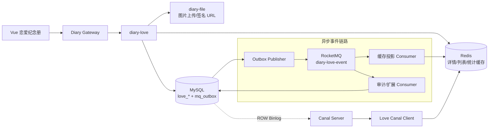
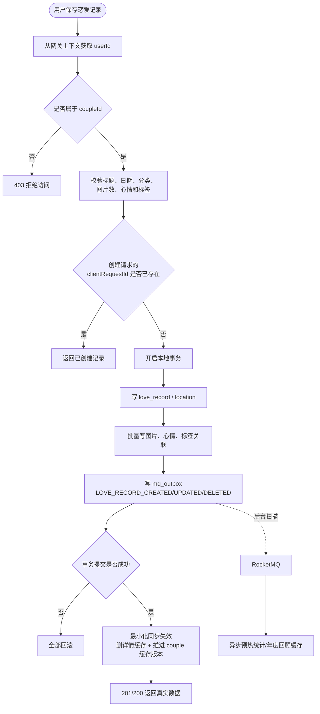
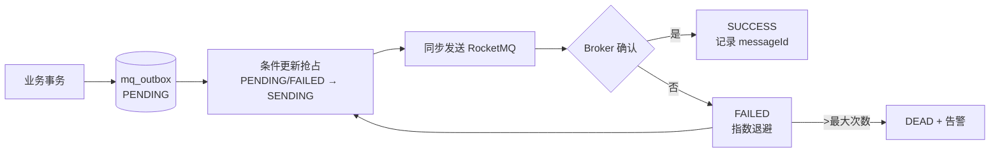

# 恋爱记录分布式应用——版本 1

> 第一版目标：先将现有前端的本地纪念册变成可真实使用的后端业务，在不牺牲基本可用性的前提下引入异步、有界线程池、RocketMQ、Redis 和 Canal。本版不追求一次性微服务拆分到底，而是先建立正确、可运行、可演进的基线。

## 一、现状结论

### 1. 前端已有功能

- 时间线：按月和周分组，支持全部、约会、日常、旅行、纪念日筛选。
- 记录管理：新增、编辑、删除、详情、标记重要回忆。
- 记录字段：标题、日期、内容、最多 8 张图片、地点、心情、标签、分类、重要标记。
- 相册：照片墙和年份筛选。
- 地图：地点聚合、访问次数、最近访问、地图标记与降级展示。
- 年度回顾：记录数、地点数、照片数、旅行数、月度趋势、关键词、热门地点和高光记录。
- 设置：恋爱起始日、伴侣名、纪念日、JSON 导入/导出、清空数据。

当前数据全部来自 `mock + localStorage`，图片以 Data URL 保存，恋爱记录页还没有调用后端 API。

### 2. SQL 已有数据模型

| 表 | 用途 | 对应前端功能 |
| --- | --- | --- |
| `love_couple` | 恋爱关系 | 起始日、伴侣信息 |
| `love_anniversary` | 纪念日 | 纪念日设置、即将到来 |
| `love_location` | 地点 | 地图、足迹聚合 |
| `love_record` | 记录主表 | 时间线、详情、年度回顾 |
| `love_record_image` | 记录与公共图片的关联 | 照片与封面 |
| `love_mood` / `love_record_mood` | 心情字典与关联 | 多选心情 |
| `love_tag` / `love_record_tag` | 自定义标签与关联 | 标签和年度关键词 |
| `love_menstrual_cycle` | 生理期记录 | 未在当前前端展示，暂不进入 V1 主流程 |

### 3. 前后端必须统一的差异

- 前端分类是中文，后端持久化统一使用 `DATE / DAILY / TRAVEL / ANNIVERSARY`，由 DTO 转换。
- 前端图片从 Data URL 改为：先调用 `diary-file` 上传，再把 `imageId` 提交给恋爱记录服务。
- 坐标只保存 WGS84 经纬度；前端的 `x/y` 仅是静态地图降级展示值，不入库。
- 前端字符串 ID 改为后端 Snowflake `BIGINT`，对 JSON 输出时以字符串传输，避免 JavaScript 整数精度丢失。

## 二、V1 功能边界

### 必须交付

1. 创建或维护一个恋爱关系，校验当前用户是否属于该关系。
2. 纪念日的查询、新增、修改、删除和即将到来计算。
3. 恋爱记录 CRUD、详情、分类/日期/重要标记筛选、游标分页。
4. 图片关联、心情关联、标签关联和地点信息的事务保存。
5. 相册列表、足迹聚合、年度回顾、首页汇总数据。
6. JSON 导出；JSON 导入限制文件大小和记录数，以单个本地事务完成。
7. Redis 缓存、RocketMQ 异步事件、Outbox 可靠投递、Canal 缓存失效兜底。
8. 基本鉴权、参数校验、幂等、日志、健康检查与关键指标。

### V1 暂不做

- 生理期页面、AI 回忆生成、搜索引擎、分库分表、多地活、推荐系统。
- 不将每张表拆成微服务；V1 新增一个 `diary-love` 业务服务，保持模块内高内聚。
- 不让 Redis、RocketMQ 或 Canal 成为基本 CRUD 成功的必要条件。

## 三、V1 总体架构



### 设计底线

- MySQL 是唯一业务事实源。
- 写请求在一个本地事务内写入业务表和 `mq_outbox`，提交后即可返回。
- Redis 未命中或不可用时回源 MySQL，不阻断基本查询。
- RocketMQ 暂时不可用时，Outbox 保留待发事件，恢复后继续投递。
- Canal 只做缓存失效/版本推进，不反向修改业务数据。

## 四、同步业务主流程



## 五、异步与线程池

### 1. 异步使用点

- 首页汇总：用 `CompletableFuture` 并行查询关系信息、即将到来的纪念日、最近记录和统计。
- 记录变更后：通过 RocketMQ 异步重建年度统计、足迹和热门标签缓存。
- Outbox 投递：定时分批抢占待发记录，同步等待 Broker 确认后更新状态。
- 图片 URL 组装：调用 `diary-file` 批量获取，不为每张图片创建一个无界线任务。

### 2. 线程池基线

| 线程池 | 用途 | V1 建议初值 | 拒绝策略 |
| --- | --- | --- | --- |
| `loveQueryExecutor` | 首页和详情的并行组装 | core=4, max=8, queue=200 | `CallerRunsPolicy` 反压 |
| `loveCacheExecutor` | MQ 消费后的缓存投影 | core=2, max=4, queue=500 | `AbortPolicy`，让消费返回失败后重试 |
| `loveOutboxScheduler` | Outbox 扫描与发送 | 1 个调度线程，每批 100 | 本轮停止，下轮重试 |

上述数值是开发基线，正式环境根据 CPU、DB 连接池和压测结果调整。所有线程池必须有界，线程名包含 `love-`，通过 `TaskDecorator` 传递 MDC `traceId`，并暴露 active、queue、reject 指标。

> RocketMQ Listener 不允许“提交到线程池后立即 ACK”。必须等待投影任务成功再 ACK；超时、拒绝或异常均交给 RocketMQ 重试。

## 六、RocketMQ 与可靠消息

### Topic 与事件

- Topic：`diary-love-event`
- Tags：`RECORD_CREATED`、`RECORD_UPDATED`、`RECORD_DELETED`、`ANNIVERSARY_CHANGED`、`COUPLE_CHANGED`
- Message Key：`eventId`；业务索引使用 `aggregateId`。
- 消息体：`eventId`、`eventType`、`aggregateId`、`coupleId`、`operatorUserId`、`occurredAt`、`schemaVersion`、`traceId`。

### Outbox 投递流程



- 直接复用现有 `mq_outbox` 思路，但需将状态注释与实现统一，明确是否包含 `SENDING`。
- 新增 `mq_consume_log(consumer_group, event_id, status, create_time)`，唯一键 `(consumer_group, event_id)` 保证消费幂等。
- 投影消费者执行“插入消费记录 → 更新投影/缓存 → 标记成功”；重复消息直接 ACK。
- 消费重试超限后进入 DLQ，保留原始 payload、eventId 和 traceId，并告警。

## 七、Redis 设计

### Cache Aside 键

| Key | 内容 | TTL |
| --- | --- | --- |
| `love:couple:user:{userId}` | 当前用户的关系 ID | 30 分钟 |
| `love:record:{recordId}` | 记录详情 | 30 分钟 + 随机抖动 |
| `love:cache:ver:{coupleId}` | 该关系的列表/统计缓存版本 | 不过期 |
| `love:timeline:{coupleId}:{ver}:{queryHash}` | 时间线分页 | 5 分钟 + 抖动 |
| `love:stats:{coupleId}:{ver}:{year}` | 年度回顾 | 30 分钟 + 抖动 |
| `love:footprints:{coupleId}:{ver}` | 足迹聚合 | 30 分钟 + 抖动 |
| `love:anniversary:{coupleId}:{ver}` | 纪念日 | 30 分钟 + 抖动 |

### 一致性策略

1. 查询：先查 Redis，未命中查 MySQL 并回填。
2. 写入：先提交 MySQL，再删除详情 Key 并 `INCR love:cache:ver:{coupleId}`。
3. MQ 消费者做第二次失效并预热热点聚合数据。
4. Canal 监听 Binlog 做第三道兜底，覆盖手工 SQL、其他服务写库或程序异常退出。
5. 空值缓存 30–60 秒，TTL 增加随机抖动；热点重建使用短锁，锁失败的请求回源 DB，不无限等待。

## 八、Canal 设计

### V1 职责

- MySQL 开启 ROW 模式 Binlog，Canal 订阅 `love_*` 业务表。
- 获取 `table + operation + before + after`，解析 `record_id / couple_id`。
- `love_record`、`love_anniversary`、`love_couple`、`love_location`、`love_tag` 可直接定位 `coupleId`。
- 关联表只有 `recordId` 时，通过本地查询找到 `coupleId`，然后删除详情 Key 并推进关系缓存版本。
- Redis 处理成功后才 ACK Canal position；处理失败不 ACK，重试时重复失效必须安全。

### Canal 与 RocketMQ 的边界

- RocketMQ 传播有业务语义的领域事件，未来可接通知、动态、搜索、数据分析。
- Canal 只关心“哪些表变了”，V1 仅用于缓存一致性修复。
- 两者可能重复失效同一缓存，`DEL` 和版本推进允许重复执行，不依赖严格的消息先后顺序。

## 九、V1 API 大纲

### 关系与纪念日

- `GET /love/couples/current`
- `PUT /love/couples/current`
- `GET /love/anniversaries`
- `POST /love/anniversaries`
- `PUT /love/anniversaries/{id}`
- `DELETE /love/anniversaries/{id}`

### 恋爱记录

- `GET /love/records?cursor=&size=&category=&year=&important=`
- `GET /love/records/{id}`
- `POST /love/records`，请求头必须带 `Idempotency-Key`
- `PUT /love/records/{id}`，携带 `versionId` 做乐观锁
- `DELETE /love/records/{id}`
- `PATCH /love/records/{id}/important`

### 视图与数据管理

- `GET /love/albums?year=&cursor=&size=`
- `GET /love/footprints?year=`
- `GET /love/reviews/{year}`
- `GET /love/home`
- `GET /love/export`
- `POST /love/import`
- `DELETE /love/records`，需二次确认令牌，只逻辑删除当前关系数据。

列表统一使用游标分页，游标由 `recordDate + id` 组成，与现有 `idx_love_record_timeline` 匹配，避免深分页。

## 十、数据库最小补强

1. `love_record`、`love_couple`、`love_anniversary` 增加 `version_id INT NOT NULL DEFAULT 0`，编辑时乐观锁防止双方覆盖。
2. 为创建记录幂等新增 `love_request_dedup(user_id, client_request_id, record_id, create_time)`，唯一键 `(user_id, client_request_id)`。
3. 复用公共 `mq_outbox`，增加 `mq_consume_log`。
4. 审查 `mq_outbox.status` 枚举和实际 SQL，避免实体注释、查询条件与运行状态不一致。
5. 不创建物理外键，但 Service 在事务内校验所有 `imageId / moodId / tagId / locationId` 的所属关系。

## 十一、建议代码结构

```text
diary-love
└── src/main/java/diary/love
    ├── controller       # REST 接口
    ├── application      # 用例编排、事务边界
    ├── domain           # Couple、Record、Anniversary 规则
    ├── repository       # Mapper/Repository 接口
    ├── infrastructure
    │   ├── persistence  # MyBatis
    │   ├── redis        # Cache Aside、KeyFactory
    │   ├── rocketmq     # Outbox Publisher、Consumer
    │   ├── canal        # Binlog 失效处理
    │   └── client       # diary-file 调用
    ├── config           # 线程池、Redis、MQ 配置
    └── support          # 异常、幂等、鉴权、追踪
```

V1 可先按模块化单体实现，但不允许 Controller 直接调 Mapper，也不允许 MQ/Redis/Canal 细节泄漏到领域对象。

## 十二、可用性与验收标准

### 业务验收

- 创建一条含图片、地点、心情和标签的记录后，时间线、相册、地图和年度回顾均能看到。
- 编辑、删除、重要标记、纪念日、关系信息、导入导出可用。
- 用户不能访问或修改其他恋爱关系的数据。
- 同一 `Idempotency-Key` 并发提交只生成一条记录。

### 故障验收

- Redis 停机：读取回源 MySQL，写入仍能成功，并有降级日志和指标。
- RocketMQ 停机：记录可保存，`mq_outbox` 保留待发数据；MQ 恢复后自动补发。
- 重复投递：消费日志唯一索引生效，不重复产生副作用。
- Canal 停机：主业务不受影响；恢复后从上次 position 继续消费。
- 直接 SQL 修改 `love_record`：Canal 能使旧缓存失效。
- 线程池饱和：不无限创建线程、不 OOM，拒绝可观测，重要 MQ 任务可重试。

### 最小观测指标

- API：QPS、P95/P99、错误率、慢 SQL。
- Redis：命中率、回源次数、重建次数。
- RocketMQ：发送成功率、消费延迟、重试数、DLQ 数。
- Outbox：PENDING/FAILED/DEAD 数量和最旧事件年龄。
- Canal：Binlog 延迟、重试数、最后成功 position 时间。
- 线程池：active、queue size、completed、reject。

## 十三、实施顺序

1. 新建 `diary-love` 模块，完成建表补丁、实体、Mapper 和鉴权骨架。
2. 完成关系、纪念日、恋爱记录 CRUD 和图片/心情/标签/地点事务。
3. 完成时间线、相册、足迹、年度回顾和首页汇总 API，前端移除 `localStorage` 主数据源。
4. 接入 Redis Cache Aside，验证 Redis 故障时的 DB 回源。
5. 接入 `mq_outbox + RocketMQ + mq_consume_log`，完成异步缓存投影。
6. 接入 Canal 失效兜底，完成直改 DB 验证。
7. 完成导入/导出、故障测试、并发测试、指标与告警。

## 十四、后续版本演进方向

### 版本 2：可靠性与高并发加深

- 纪念日扫描 + RocketMQ 延时/定时消息 + `diary-notify` 通知闭环。
- 年度回顾、足迹、标签趋势改为持久化读模型，引入基础 CQRS。
- Redis Cluster、热 Key/大 Key 治理、Lua 原子操作、缓存预热和多级缓存。
- Outbox 分片扫描、租约抢占、指数退避、补偿任务和 DLQ 管理页。
- Sentinel 限流/熔断、OpenTelemetry 链路追踪、Prometheus + Grafana 看板、Testcontainers 集成测试。
- 导入改为任务化，支持进度、重试、部分失败报告和大数据量。

### 版本 3：企业级事件驱动分布式应用

- 按业务边界拆分恋爱档案、媒体、通知、搜索/数据分析服务，使用 DDD 聚合和版本化事件契约。
- Kubernetes 容器化部署，Nacos 注册/配置，网关、灰度发布、自动扩缩容和多可用区容灾。
- RocketMQ 事件总线 + CDC 数据管道，Schema Registry/契约测试，完整的重放、对账和数据修复能力。
- MySQL 读写分离与分片评估，Redis Cluster，OpenSearch 检索，OSS + CDN 图片处理链。
- 零信任服务身份、敏感数据加密、审计日志、数据导出/删除合规和灾难恢复演练。
- SLO/错误预算、全链路可观测、故障注入、容量模型和常态化压测，达到可运营的企业级水准。

---

V1 的成功标准不是“用了多少中间件”，而是前端现有五个视图真正用后端数据跑通，且 MySQL、Redis、RocketMQ、Canal 之间的职责清晰，任一非核心中间件短时故障都不会导致恋爱记录无法保存。
